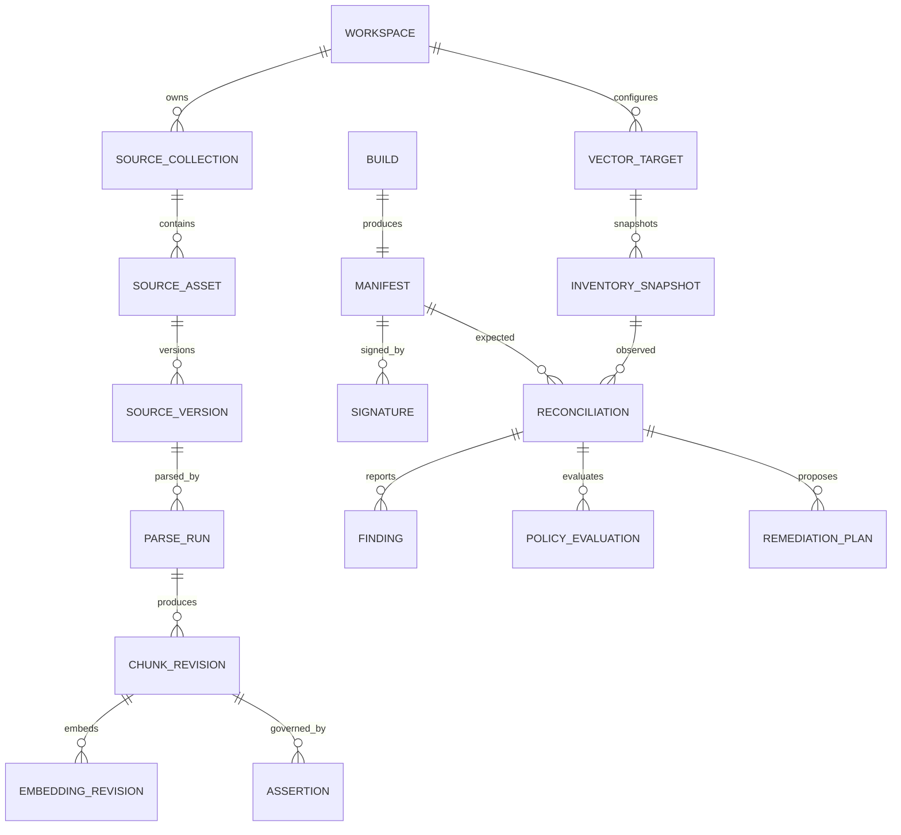
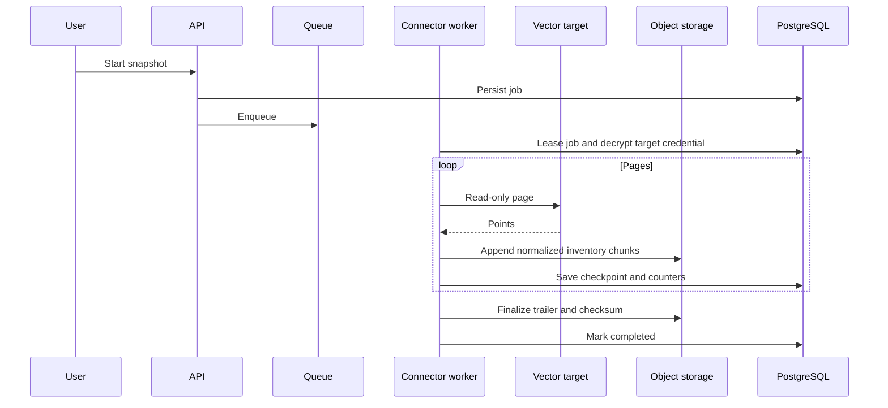
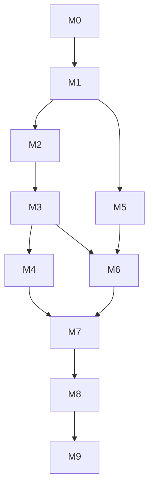

# RAG Knowledge Ledger

## Uçtan Uca Ürün ve Teknik Uygulama Spesifikasyonu

Belge sürümü: 1.0.0  
Belge tarihi: 20 Temmuz 2026  
Repository slug: `rag-knowledge-ledger`  
CLI ve Python package adı: `ragledger`  
Manifest media type: `application/vnd.ragledger.manifest.v1+json`  
Lisans: Apache License 2.0  
Doküman dili: Türkçe  
Kod, API, veri tabanı, dosya ve sınıf adları: İngilizce

---

## 0. Uygulama ajanı için bağlayıcı talimatlar

Bu belge v1.0'ın tek doğruluk kaynağıdır. Coding agent yalnız bir manifest JSON örneği veya Qdrant scripti üretmeyecek; source ingestion, parser/chunker/embedding lineage, signed manifest, index inventory, reconciliation, policy, PII/license/ACL kontrolleri, CLI, API, worker, web arayüzü, persistence, security, deployment ve testlerin tamamını uygulayacaktır.

1. `TODO`, `TBD`, placeholder, fake connector, sabit dashboard verisi, no-op policy veya gerçek indexi denetlemeyen “demo” bırakma.
2. Ledger'ın gerçeği uydurmasına izin verme. Kaynağı gözlenmeyen metadata `unknown` olur; tahmin edilen lisans veya parser sürümü kesin fact olarak yazılmaz.
3. Manifest kayıtları immutable ve content-addressed olmalıdır. Değişiklik yeni manifest/revision üretir.
4. Document content, chunk text ve vector payload güvensiz veri kabul edilir; talimat değildir. LLM v1 core karar motoru değildir.
5. Secret, PII, ACL ve tenant güvenliği ilgili pipeline özelliğiyle birlikte uygulanır.
6. README, `CONTRIBUTING.md`, `SECURITY.md`, `CODE_OF_CONDUCT.md`, issue şablonları, changelog, commit mesajları ve diğer açık kaynak yönlendirme belgelerinde emoji kullanılmaz. UI'da emoji yerine SVG ikon kullanılır.
7. Agent kendisini veya başka bir AI'ı contributor, author, co-author, maintainer ya da bot olarak ekleyemez. `Co-authored-by`, model/agent adı, bot Git identity'si, generated-by ibaresi ve `CONTRIBUTORS.md` yasaktır. Kullanıcının Git kimliği değiştirilmez.
8. Owner-authorized implementation agent doğrudan `main` dalında çalışır. Feature branch/PR açmaz; remote main değişikliklerini ve user worktree'sini korur; force push yapmaz; gerekli testler geçtikten sonra main'e push eder. Haricî açık kaynak katkıcıları ayrı PR sürecini kullanır.
9. Sürüm ve image'lar lock/digest ile pinlenir; floating `latest` yoktur.
10. v1 non-goals korunur. Genel RAG platformu, chatbot veya vector database UI ürününe dönüşme.

### 0.1 Üçlü çapraz çalışma protokolü

| Rol | Sorumluluk | Zorunlu çapraz kontrol |
|---|---|---|
| Lineage and Domain Agent | Manifest schema, identity/hash, pipeline lineage, reconciliation taxonomy, policy domain | Connectorların semantic parity'si |
| Platform and Product Agent | API, workers, persistence, UI, CLI, reports, deployment | Her evidence'ın drill-down ve exportu |
| Security, Governance and QA Agent | PII, ACL, tenant, signing, threat model, tests, release | Manifest/log/artifact sızıntıları ve policy bypass |

Her milestone için `docs/reviews/<milestone>-lineage.md`, `...-platform.md`, `...-security.md` üretilir; kişisel/agent contributor atfı içermez.

### 0.2 Koddan önce üretilecek belgeler

- `IMPLEMENTATION_STATUS.md`
- `docs/architecture/adr/`
- `docs/architecture/threat-model.md`
- `docs/spec/manifest-v1.schema.json`
- `docs/spec/policy-v1.schema.json`
- `docs/testing/test-matrix.md`
- Generated `docs/api/openapi.json`

---

## 1. Yönetici özeti

RAG Knowledge Ledger, bir retrieval-augmented generation bilgi tabanındaki her indexed point'in hangi kaynak belgenin hangi sürümünden; hangi parser, OCR, chunker ve embedding ayarlarıyla üretildiğini kaydeden, imzalayan ve gerçek vector index ile karşılaştıran açık kaynak bir lineage ve integrity platformudur.

RAG sistemlerinde sık görülen sorunlar:

- Kaynak güncellenir fakat eski chunklar indexte kalır.
- Belge silinir, vector pointler yaşamaya devam eder.
- Aynı içerik farklı path veya ingestion runlarla çoğalır.
- Parser/chunker/model sürümü değişir fakat index kısmi rebuild olur.
- Farklı embedding dimension/model aynı collectionda karışır.
- Chunk payload'ında source/version bilgisi eksik veya yanlış olur.
- PII ya da lisansı bilinmeyen içerik indexe girer.
- ACL/tenant metadata'sı kaynakla uyuşmaz ve retrieval veri sızıntısı yaratır.
- Bir cevabın kullandığı chunk'ın provenance'ı doğrulanamaz.

Ledger bu sorunları “doküman listesini gösteren panel” olarak değil, content-addressed evidence zinciri ve reconciliation motoruyla çözer. Kaynak snapshot'ı, parse çıktısı, chunk identity'si, embedding identity'si ve indexed-point locator ayrı kayıtlar olarak saklanır. Connectorlar Qdrant ve pgvector envanterini çıkarır. Sistem expected manifest ile observed indexi karşılaştırır; stale, orphan, missing, duplicate, metadata/ACL/tenant drift ve embedding mismatch bulguları üretir. Policy engine bu bulguları CLI/CI gate'e dönüştürür.

---

## 2. Problem tanımı ve farklılaşma

### 2.1 Problem

Bir vector database point'i çoğu zaman `id`, `vector` ve serbest JSON payload'dan ibarettir. RAG framework'leri ingestion sırasında metadata eklese de bu metadata'nın standardı, bütünlüğü, güncelliği ve kaynağa bağlanması garanti değildir. Belge lifecycle ile index lifecycle arasında transaction bulunmadığı için sessiz drift oluşur.

Bir production cevabı hatalı olduğunda aşağıdaki sorular genellikle cevaplanamaz:

1. Bu chunk hangi exact dosya bytes'ından geldi?
2. Parser ve OCR hangi sürüm/config ile çalıştı?
3. Chunk boundary ve contextualized embedding text neydi?
4. Hangi embedding model revision/dimension/distance kullanıldı?
5. Point hangi index/collection/table/tenant partition'a yazıldı?
6. Kaynak artık mevcut mu ve content hash aynı mı?
7. Point payload ACL ve tenant etiketi kaynak policy ile aynı mı?
8. PII/license scan ingestion öncesi çalıştı mı ve sonucu neydi?

### 2.2 Mevcut kategorilerden farkı

Bu proje:

- Vector database değildir.
- RAG chatbot/retriever değildir.
- Document parser/chunker'ın yerine geçmez.
- Genel data catalog veya enterprise governance suite değildir.
- SBOM formatını doğrudan kopyalayan yazılım tarayıcısı değildir.

Belirli boşluğu doldurur: RAG knowledge base için taşınabilir, imzalanabilir manifest; pipeline provenance; observed index inventory; deterministic reconciliation; CI policy.

### 2.3 Tasarım ilkeleri

- Evidence first: her finding expected ve observed fingerprintlere bağlıdır.
- Unknown is a value: eksik bilgi otomatik pass değildir.
- Content-addressed: path değil hash identity'nin temelidir.
- Connector parity: Qdrant ve pgvector aynı domain modeline map edilir.
- No silent repair: v1 otomatik index silme/yazma yapmaz; remediation plan üretir.
- Privacy by default: raw PII değerleri finding/log'a yazılmaz.
- Deterministic core: LLM olmadan tüm lineage/reconciliation çalışır.

---

## 3. Hedefler ve başarı ölçütleri

### 3.1 Hedefler

1. `ragledger build ./docs` ile reproducible manifest üretmek.
2. Qdrant veya pgvector envanterini alıp manifestle karşılaştırmak.
3. Stale/orphan/missing/duplicate/metadata/embedding/ACL/tenant sorunlarını kesin taxonomy ile bulmak.
4. Manifestin canonical hash ve Ed25519 signature ile bütünlüğünü doğrulamak.
5. PII, license ve access metadata kontrollerini lineage evidence'a bağlamak.
6. CI'da policy fail için stable exit code ve SARIF/JUnit/HTML raporu üretmek.
7. Python SDK ile mevcut ingestion pipeline'ına instrumentation eklemek.
8. Web UI'da source'tan point'e ve point'ten source'a lineage gezintisi sağlamak.

### 3.2 Sayısal hedefler

| Ölçüt | v1.0 hedefi |
|---|---:|
| Mandatory source formats | PDF, DOCX, HTML, Markdown, plain text |
| Mandatory vector connectors | Qdrant, pgvector |
| Portable inventory | NDJSON import/export |
| Reconciliation categories | En az 15 |
| Core branch coverage | Yüzde 90 |
| Backend branch coverage | Yüzde 85 |
| 1 milyon point inventory memory | 1 GiB altında streaming |
| 1 milyon point reconciliation | Referans donanımda 15 dakikadan az |
| Manifest same-input determinism | Byte-identical canonical manifest |
| Signature verification | Yüzde 100 tamper detection fixtures |
| Secret/raw PII log leak | Sıfır |
| Connector parity fixture | Yüzde 100 aynı normalized finding |

Performance benchmark donanım/config ile versioned artifact olarak yayımlanır; iddialar sentetik demo olmadan yazılmaz.

---

## 4. Kullanıcılar ve kullanım senaryoları

| Persona | İhtiyaç |
|---|---|
| AI/LLM Engineer | RAG indexinin hangi içerikten oluştuğunu bilmek |
| Platform Engineer | Rebuild/deploy öncesi drift gate çalıştırmak |
| Data Governance Engineer | PII, license ve lineage denetlemek |
| Security Engineer | ACL/tenant metadata driftini bulmak |
| Incident Responder | Problemli cevabın source/chunk provenance'ını izlemek |
| Open-source Maintainer | Yeni parser/vector connector eklemek |

### UC-01: Manifest build

Kullanıcı source root, parser/chunker/embedding config verir. Sistem dosyaları fingerprint eder, Docling ile parse eder, deterministic chunklar üretir, optional local embedding çalıştırır ve manifest/artifacts oluşturur. Aynı input/config ikinci çalıştırmada aynı entity IDs ve canonical manifest hash'i üretir.

### UC-02: Existing index adoption

Kullanıcı Qdrant collection veya pgvector table bağlantısı tanımlar. Connector observed inventory çıkarır. Payload'da tam ledger metadata yoksa known alanlar map edilir, bilinmeyenler unknown. Araç legacy index için coverage report verir; history uydurmaz.

### UC-03: Reconciliation

Manifest ve observed snapshot karşılaştırılır. 12 stale chunk, 3 orphan point, 2 missing point, 1 embedding config mismatch ve ACL drift raporlanır. Her bulgu source, chunk ve point locator'a drill-down sağlar.

### UC-04: CI gate

Docs değişikliği sonrası candidate manifest üretilir. Index snapshot ile policy çalışır. Critical ACL drift veya stale ratio threshold aşılırsa exit 3; HTML/JSON/JUnit/SARIF artifact.

### UC-05: Signed release manifest

Release ingestion manifesti Ed25519 private key ile imzalanır. Deployment öncesi public key ile verify edilir. Bir chunk metadata'sı değiştirildiğinde signature fail olur.

### UC-06: Incident investigation

Uygulama logundan `chunk_id` alınır. UI/CLI source version, page/section, parser/chunker/model, PII/license/ACL assertions ve index snapshots history'sini gösterir.

---

## 5. Kapsam

### 5.1 v1.0 zorunlu

- Local filesystem source discovery.
- PDF, DOCX, HTML, Markdown, TXT parse.
- Docling primary parser; plain text/Markdown lightweight adapters.
- Parser result artifact ve structural elements.
- Hierarchical ve hybrid chunking; custom adapter interface.
- Deterministic chunk identity ve contextualized text hash.
- Local Sentence Transformers embedding adapter ve “metadata-only/no vectors” mode.
- External embedding import metadata; cloud embedding API v1 zorunlu değildir.
- RAG Ledger Manifest v1 JSON Schema.
- RFC 8785 canonicalization, SHA-256 ve Ed25519 signing.
- Qdrant connector.
- pgvector connector with configurable safe SQL mapping.
- NDJSON portable inventory connector.
- Full and sampled snapshot; policy sampling limitations.
- Reconciliation taxonomy ve remediation plan.
- PII scan with Presidio plus deterministic recognizers.
- License assertion with SPDX identifiers and path/frontmatter rules.
- ACL/tenant expected policy and observed payload comparison.
- CLI, Python SDK, FastAPI, Next.js web UI.
- PostgreSQL/Redis/S3, worker jobs, SSE progress.
- JSON, NDJSON, HTML, CSV, SARIF ve JUnit exports.
- Docker Compose ve GitHub Actions.

### 5.2 Kapsam dışı

- RAG chat/search frontend.
- Retrieval quality evaluation.
- LLM response/citation doğruluğu.
- Vector database write/delete remediation'ı otomatik uygulama.
- Canlı DB CDC veya real-time stream.
- Google Drive/SharePoint/Confluence connectors.
- OCR accuracy benchmark.
- Full enterprise data catalog.
- SAML/SCIM ve enterprise policy administration.
- Arbitrary user Python parser/plugin execution web mode.
- Raw embedding vectorları manifest JSON içine gömme.
- License hukuki uygunluk kararı; yalnız assertion ve unknown/risk.

### 5.3 Gelecek

Pinecone/Weaviate/Milvus/OpenSearch connectors, cloud source connectors, OpenLineage export, KMS/Sigstore signing, retrieval receipt verification, automatic remediation pull plan, OIDC, Kubernetes workers ve RAG framework integrations.

---

## 6. Kavramlar ve kimlik modeli

### 6.1 Lineage zinciri

```text
SourceAsset
  -> SourceVersion
    -> ParseRun
      -> DocumentElement
        -> ChunkRevision
          -> EmbeddingRevision
            -> IndexBinding
              -> ObservedPoint
```

### 6.2 Hashler

| Hash | Girdi | Amaç |
|---|---|---|
| `source_content_hash` | Raw source bytes | Exact file version |
| `parser_config_hash` | Parser name/version/config/model digests | Parse provenance |
| `parsed_document_hash` | Canonical Docling/normalized document JSON | Parser output identity |
| `chunker_config_hash` | Strategy/version/tokenizer/config | Boundary provenance |
| `chunk_content_hash` | Normalized raw chunk text | Content identity |
| `contextualized_text_hash` | Embedding'e giden exact UTF-8 text | Embedding input identity |
| `embedding_config_hash` | Provider/model revision/dimension/normalization | Vector semantics |
| `vector_hash` | Canonical little-endian float32 bytes, optional | Exact vector integrity |
| `payload_hash` | Canonical selected payload fields | Metadata integrity |
| `manifest_hash` | Signature hariç canonical manifest | Release integrity |

### 6.3 Stable IDs

- `source_id`: logical source key hash; root-relative normalized path + namespace. Rename yeni source olabilir; content dedupe relationship ayrıca kurulur.
- `source_version_id`: `source_id + source_content_hash` hash.
- `parse_run_id`: `source_version_id + parser_config_hash`.
- `chunk_id`: `parse_run_id + chunker_config_hash + structural_locator + chunk_content_hash`.
- `embedding_id`: `chunk_id + contextualized_text_hash + embedding_config_hash`.
- `index_binding_id`: target id + embedding id + expected point id.

UUID değil prefixed multihash string kullanılabilir: `chk_sha256_<base32>`. DB internal UUIDv7 taşısa da portable IDs bu content identities'dir.

### 6.4 Normalization

Raw source hash bytes'a dokunmaz. Text hash için UTF-8, Unicode NFC, CRLF->LF; trailing whitespace korunur mu configte açıkça belirtilir ve default yalnız line-ending normalization'dır. Chunker'ın gördüğü text ile hash text aynı olmalıdır; görünmez agresif normalization yok.

---

## 7. Manifest v1

### 7.1 Envelope

```json
{
  "schema": "https://ragledger.dev/schemas/manifest-v1.json",
  "media_type": "application/vnd.ragledger.manifest.v1+json",
  "manifest_version": "1.0",
  "created_at": "2026-07-20T00:00:00Z",
  "ledger_version": "1.0.0",
  "namespace": "example-support-kb",
  "build": {},
  "sources": [],
  "parse_runs": [],
  "chunks": [],
  "embeddings": [],
  "index_bindings": [],
  "assertions": [],
  "artifacts": [],
  "statistics": {},
  "integrity": {
    "canonicalization": "RFC8785",
    "hash_algorithm": "sha256",
    "manifest_hash": "..."
  },
  "signatures": []
}
```

### 7.2 Kurallar

- JSON Schema additionalProperties varsayılan false; extension alanları `extensions` namespace altında.
- Array order canonical semantics taşır ve builder deterministic sort uygular.
- Raw vector ve full raw document manifestte yok; artifact refs olabilir.
- Timestamp determinismi nedeniyle manifest identity hesaplanırken `created_at` dahil mi kararı: dahil edilir; reproducible build için user/source date epoch veya explicit timestamp gerekir. `--reproducible` modunda timestamp `SOURCE_DATE_EPOCH` ya da latest source mtime canonical UTC. Aynı input/config ve epoch byte-identical.
- Signature hesaplanırken `signatures` boş array olarak canonicalized payload; `manifest_hash` alanı hash öncesi omitted/empty normative algorithm ile schema dokümante edilir. Circularity yok.

### 7.3 Source record

Source id/version, namespace, relative URI, media type, size, raw hash, modified time informational, source system, declared ACL/tenant, license assertions, raw artifact ref, deletion/tombstone.

### 7.4 Parse record

Parser name, package version, container/image digest, config hash/config redacted, OCR engine/model/languages, status, warnings, parsed artifact hash/ref, duration. Machine path veya secret yok.

### 7.5 Chunk record

Chunk id, source version/parse run, structural locator (page, heading path, element refs, ordinal), raw/contextualized hash, token count with tokenizer identity, text artifact ref optional, neighbor IDs, metadata, PII/license/ACL assertion refs.

### 7.6 Embedding record

Embedding id, chunk id, model provider/name/revision, dimension, dtype, normalization, distance expectation, contextualized hash, vector hash optional, generated_at, usage optional. API key yok.

### 7.7 Index binding

Expected target, collection/table namespace, point id, embedding id, expected payload projection/hash, tenant/ACL projection, write status/receipt if instrumented. Connection URL/credential manifestte yok; target alias kullanılır.

### 7.8 Assertions

Typed records:

- `PII_SCAN`: scanner/version/config, finding counts/types/confidence, masked evidence refs.
- `LICENSE`: SPDX expression veya `NOASSERTION`, source/method/confidence.
- `ACL`: canonical principals/roles/labels hash.
- `TENANT`: tenant key/value hash.
- `QUALITY`: parser/chunk warnings.

Assertion sonucu fact/policy decision ayrılır. PII found bir fact; “block indexing” policy outcome.

---

## 8. Fonksiyonel gereksinimler

### 8.1 Workspace, auth ve targets

- `FR-001`: Local admin bootstrap, workspace ve roles `owner/editor/viewer`.
- `FR-002`: API tokens scope: sources, builds, targets, snapshots, reconciliations, policies, admin.
- `FR-003`: Target credentials AES-256-GCM encrypted, write-only ve versioned olmalıdır.
- `FR-004`: Target URL SSRF-safe validate; private host yalnız explicit admin allowlist.
- `FR-005`: Workspace export secret ve raw document varsayılan dışı, manifest/report dahil.

### 8.2 Source discovery

- `FR-010`: Root directory recursion `.gitignore` ve `.ragledgerignore` uygular.
- `FR-011`: Symlink default follow edilmez; follow seçilirse resolved path root içinde kalmalıdır.
- `FR-012`: Stable relative URI POSIX normalize ve Unicode NFC.
- `FR-013`: MIME content sniff + extension; unsupported file finding, sessiz skip yok.
- `FR-014`: Max file default 100 MiB, PDF 500 sayfa; admin caps.
- `FR-015`: Source hash streaming; tüm dosya memory'e alınmaz.
- `FR-016`: Duplicate content farklı pathte relationship üretir; otomatik birini silmez.
- `FR-017`: Deletion önceki manifestle karşılaştırıldığında tombstone candidate olur.

### 8.3 Parsing

- `FR-020`: Docling adapter PDF/DOCX/HTML için primary, Markdown/TXT native deterministic adapter.
- `FR-021`: Parser version/config/model artifacts exact kaydedilir.
- `FR-022`: Parse success/partial/fail ayrılır; partial warning lineage'a girer.
- `FR-023`: OCR açık/kapalı, language, engine/model ve confidence config kaydedilir.
- `FR-024`: Parsed structured document canonical JSON artifact olur.
- `FR-025`: Parser network kullanmaz; source içindeki external URL fetch edilmez.
- `FR-026`: Embedded file/macro çalıştırılmaz.
- `FR-027`: Password-protected/encrypted document explicit error; password v1 web UI desteklemez.

### 8.4 Chunking

- `FR-030`: Built-in `hierarchical`, `hybrid`, `line_based` strategies.
- `FR-031`: Tokenizer exact name/revision ve max tokens/overlap/config hash.
- `FR-032`: Chunk order deterministic; parallel parse sonuç sırası source/locator ile sort.
- `FR-033`: Contextualization template declarative; arbitrary code yok.
- `FR-034`: Heading/table caption/page metadata preserve edilir.
- `FR-035`: Table header repetition hash inputuna dahildir.
- `FR-036`: Oversized indivisible element policy split/fail/configurable; sessiz truncate yok.
- `FR-037`: Empty/whitespace-only chunk oluşturulmaz, count warning.
- `FR-038`: Duplicate chunk content exact ve near-duplicate optional MinHash olarak raporlanır; identity exact hash.

### 8.5 Embedding

- `FR-040`: Metadata-only mode vector üretmeden manifest/reconciliation payload lineage yapabilir.
- `FR-041`: Local Sentence Transformers adapter model revision/digest, dimension, dtype, normalize flag kaydeder.
- `FR-042`: Batch size ve device config deterministik evidence; GPU nondeterminism vector hash policy ile.
- `FR-043`: Vector NaN/Inf reddedilir.
- `FR-044`: Dimension model deklarasyonu ve ilk vector ile doğrulanır.
- `FR-045`: Vector hash canonical float32 little-endian bytes; input float16 ise original dtype metadata ve hash convention açık.
- `FR-046`: Raw vectors manifestte yok; optional encrypted artifact veya hiç saklamama.
- `FR-047`: External embedding import, user-provided exact metadata yoksa unknown; model adı tahmin edilmez.

### 8.6 PII

- `FR-050`: Presidio analyzer plus deterministic regex/checksum recognizers.
- `FR-051`: Scanner language/config/version kaydedilir.
- `FR-052`: Raw PII value finding/DB/log'a yazılmaz. Entity type, confidence, masked context hash, offsets yalnız chunk artifact yetkisine göre.
- `FR-053`: Scan source parsed text ve contextualized chunk üzerinde ayrı çalışabilmelidir.
- `FR-054`: Allowlist/denylist custom recognizers YAML ve tested regex timeout/bounds.
- `FR-055`: Presidio hiçbir PII bulmadığında “guaranteed clean” değil `no findings detected` assertion.
- `FR-056`: Policy entity type/confidence/count ile warn/block.

### 8.7 License

- `FR-060`: License source: user assertion, frontmatter, sidecar metadata, path rule; content text tahmini v1 fact değildir.
- `FR-061`: SPDX identifier/expression validate edilir; unknown `NOASSERTION`.
- `FR-062`: Birden çok assertion conflict finding.
- `FR-063`: Policy allow/deny/unknown davranışı.
- `FR-064`: License text full copy gerekmez; source locator/hash.

### 8.8 ACL ve tenant

- `FR-070`: Expected ACL source metadata/path policy/sidecar'dan canonical set.
- `FR-071`: Principal identifiers normalize fakat hashlenmeden manifestte bulunması workspace policy; public exportta hash/redaction.
- `FR-072`: Expected tenant mandatory/optional policy.
- `FR-073`: Observed payload field mapping target configte JSONPath/column mapping.
- `FR-074`: Missing ACL, broader observed ACL, narrower ACL, set mismatch ayrı finding.
- `FR-075`: Tenant missing/mismatch/cross-tenant duplicate critical policy olabilir.
- `FR-076`: ACL ordering semanticsiz canonical sort; wildcard özel typed value.

### 8.9 Build ve manifest

- `FR-080`: Build plan source count, estimated parse/chunk/embed cost ve resource caps gösterir.
- `FR-081`: Pipeline stage artifact cache content/config hash ile.
- `FR-082`: Same input/config/reproducible epoch canonical manifest byte-identical.
- `FR-083`: Partial build manifest üretilebilir fakat status `incomplete`; policy default fail.
- `FR-084`: Manifest JSON Schema validate edilir.
- `FR-085`: Manifest ve detached/embedded Ed25519 signature.
- `FR-086`: Signature key id public key fingerprint; private key manifestte yok.
- `FR-087`: Verify hash, schema, signature, artifact checksums optional deep verify.

### 8.10 Index target ve snapshot

- `FR-090`: Target types Qdrant, pgvector, NDJSON.
- `FR-091`: Connector read-only credential önerir ve hiçbir mutation API/SQL çalıştırmaz.
- `FR-092`: Full snapshot cursor/scroll streaming ve resumable checkpoint.
- `FR-093`: Sample snapshot explicit method/seed/rate; completeness-dependent policies `INCONCLUSIVE`.
- `FR-094`: Snapshot target metadata: collection/table, vector dimension/distance, schema/index config, timestamp, connector version.
- `FR-095`: Observed point normalized fields: point id, vector metadata/hash optional, payload projection/hash, source/chunk/embedding ids if present, ACL/tenant.
- `FR-096`: Raw payload retention policy; default selected mapped fields only.
- `FR-097`: Snapshot immutable and content hash.

### 8.11 Qdrant connector

- `FR-100`: Collection config, named vector config, dimension/distance ve payload indexes inventory.
- `FR-101`: Scroll API pagination; all points exactly once best effort, next page token/id.
- `FR-102`: Vector retrieval default false; vector hash policy açılırsa vectors true ve resource warning.
- `FR-103`: Payload mapping configurable, missing fields unknown.
- `FR-104`: Qdrant point id string/number canonical type korunur.
- `FR-105`: Collection alias resolved actual collection metadata saklanır.

### 8.12 pgvector connector

- `FR-110`: User table/view, primary key, vector column ve mapped metadata columns explicit config.
- `FR-111`: Identifierler SQLAlchemy quoted identifiers; user raw SQL çalıştırılamaz.
- `FR-112`: Read-only transaction, statement timeout, server-side cursor/keyset pagination.
- `FR-113`: Vector dimension/type/index metadata PostgreSQL catalogs ve pgvector metadata ile.
- `FR-114`: Vector data default çekilmez; hash mode chunked query.
- `FR-115`: Composite PK canonical JSON point id.
- `FR-116`: Row-level tenant filter ancak explicit parameterized config; snapshot scope metadata'ya yazılır.

### 8.13 Reconciliation

- `FR-120`: Expected manifest ve observed snapshot compatible target scope kontrolü.
- `FR-121`: Streaming hash join: expected/observed sorted IDs veya external disk index; 1M memory bound.
- `FR-122`: Finding taxonomy aşağıda eksiksiz.
- `FR-123`: Finding expected/observed evidence refs, severity, confidence, remediation.
- `FR-124`: Summary ratios denominator ve sample completeness ile.
- `FR-125`: Same reconciliation input hashes idempotent result cache.
- `FR-126`: Previous reconciliation comparison new/resolved/persistent findings.

### 8.14 Policy ve remediation

- `FR-130`: Typed YAML/JSON policy schema; unknown key hard error.
- `FR-131`: Rules category count/ratio, severity, source path/media/license/PII/ACL/tenant, age, completeness.
- `FR-132`: Verdict PASS/WARN/FAIL/INCONCLUSIVE.
- `FR-133`: Remediation plan read-only operations listesi: reindex source versions, delete point candidates, update payload candidates, full rebuild required.
- `FR-134`: Plan hiçbir action execute etmez; source evidence ve risk içerir.
- `FR-135`: Plan JSON/CSV; destructive candidate için explicit caution.

### 8.15 Reporting/web

- `FR-140`: JSON/NDJSON/CSV/HTML/SARIF/JUnit.
- `FR-141`: Web source->chunk->embedding->point ve reverse lineage.
- `FR-142`: Findings filter, history, diff, policy, target health.
- `FR-143`: Raw sensitive artifact reveal/download audit.
- `FR-144`: SSE progress, cancel, retry failed stage.

---

## 9. Reconciliation taxonomy

| Code | Varsayılan severity | Tanım |
|---|---|---|
| `MISSING_IN_INDEX` | High | Expected binding için point yok |
| `ORPHAN_IN_INDEX` | High | Observed point expected manifestte yok |
| `STALE_SOURCE` | High | Point eski source version/chunk'a bağlı |
| `STALE_PARSE` | Medium | Parser config/output eski |
| `STALE_CHUNKING` | High | Chunker config/boundary eski |
| `EMBEDDING_MODEL_MISMATCH` | High | Model/revision/config farklı |
| `EMBEDDING_DIMENSION_MISMATCH` | Critical | Vector/collection dimension uyumsuz |
| `VECTOR_HASH_MISMATCH` | High | Aynı embedding id için vector hash farklı |
| `PAYLOAD_DRIFT` | Medium | Expected metadata projection farklı |
| `SOURCE_METADATA_MISSING` | Medium | Source/version locator eksik |
| `DUPLICATE_POINT_ID` | Critical | Inventory scope'ta kimlik çakışması |
| `DUPLICATE_CONTENT` | Medium | Aynı chunk content birden çok unintended point |
| `ACL_MISSING` | Critical | Required ACL yok |
| `ACL_BROADER_THAN_SOURCE` | Critical | Observed erişim expected'dan geniş |
| `ACL_MISMATCH` | High | Diğer ACL set farkı |
| `TENANT_MISSING` | Critical | Required tenant yok |
| `TENANT_MISMATCH` | Critical | Point yanlış tenant |
| `PII_POLICY_VIOLATION` | High/Critical | Blocked PII indexed |
| `LICENSE_UNKNOWN` | Medium | License assertion yok |
| `LICENSE_POLICY_VIOLATION` | High | Denied SPDX expression |
| `UNVERIFIABLE_POINT` | Medium | Lineage identity alanları yetersiz |
| `TARGET_SCHEMA_DRIFT` | High | Collection/table vector config expected'dan farklı |
| `MANIFEST_INCOMPLETE` | High | Expected set tamamlanmamış |
| `SNAPSHOT_INCOMPLETE` | High | Observed set full değil |

Severity policy ile override edilebilir; critical defaultlar güvenlik nedeniyle explicit override reason gerektirir.

### 9.1 Matching order

1. Exact expected point id.
2. Exact embedding id payload mapping.
3. Exact chunk id.
4. Source version + locator.
5. Content hash heuristic.

Yalnız 1–3 high-confidence match. 4 medium, 5 low ve duplicate/legacy adoption amacıyla; low-confidence match missing/orphan'ı otomatik kapatmaz, suggestion üretir.

### 9.2 Staleness

Point current manifestte yok ama previous manifestte embedding id bulunuyorsa stale lineage. Aynı logical source'un current versionı farklıysa `STALE_SOURCE`. Current source aynı, parser/chunker config değişmişse ilgili stale subtype. Böylece remediation full source reindex veya payload fix olarak ayrılır.

---

## 10. Pipeline tasarımı

```mermaid
flowchart LR
    Discover["Discover and hash sources"] --> Parse["Parse and OCR"]
    Parse --> Elements["Canonical document elements"]
    Elements --> Chunk["Chunk and contextualize"]
    Chunk --> Scan["PII, license, ACL assertions"]
    Scan --> Embed["Embed or import metadata"]
    Embed --> Bind["Create expected index bindings"]
    Bind --> Manifest["Canonical manifest"]
    Manifest --> Sign["Hash and sign"]
    Target["Vector target"] --> Snapshot["Observed inventory snapshot"]
    Sign --> Reconcile["Reconciliation engine"]
    Snapshot --> Reconcile
    Reconcile --> Policy["Policy verdict"]
    Reconcile --> Plan["Read-only remediation plan"]
```



### 10.1 Cache

Stage cache key input artifact hashes + tool exact version/config hash. Parse cache parser image digest; chunk cache parsed hash+chunker; embed cache text hash+model config. Security policy/scanner değişimi assertion cache'i invalid eder fakat parse/chunk tekrar gerekmez.

### 10.2 Failure behavior

- Source parse fail: build partial; source error; downstream skip.
- PII/license policy block: embedding/index binding default skip; manifest blocked assertion içerir.
- Embedding fail: retry transport/local OOM policy; partial.
- Signing fail: unsigned manifest artifact olabilir fakat release status fail.
- Connector page fail: checkpoint; resume; snapshot incomplete until finish.
- Reconciliation incompatible target: fail before huge scan where metadata proves mismatch.

### 10.3 Job state

Build: `QUEUED, DISCOVERING, PARSING, CHUNKING, SCANNING, EMBEDDING, ASSEMBLING, SIGNING, COMPLETED, COMPLETED_WITH_ERRORS, FAILED, CANCELLING, CANCELLED`.

Snapshot: `QUEUED, CONNECTING, INVENTORY, FINALIZING, COMPLETED, INCOMPLETE, FAILED, CANCELLED`.

Reconciliation: `QUEUED, VALIDATING, MATCHING, CLASSIFYING, POLICY, COMPLETED, FAILED, CANCELLED`.

---

## 11. Signing ve integrity

### 11.1 Algorithm

1. Manifest schema validate.
2. `signatures=[]`, `integrity.manifest_hash` omitted normative signing view.
3. RFC 8785 canonical JSON bytes.
4. SHA-256 digest.
5. Digest ve domain separator `RAGLEDGER-MANIFEST-V1\0` Ed25519 ile imzalanır.
6. `manifest_hash` ve signature record eklenir.
7. Final manifest schema validate.

Signature record: algorithm `Ed25519`, key id public key SHA-256 fingerprint, signature base64url no padding, signed_at, optional issuer. Verify final manifestten normative signing view'i yeniden üretir.

### 11.2 Key management

v1 options:

- CLI encrypted local key file (password from TTY/env secret, file mode 0600).
- Environment/secret-mounted raw key for CI.
- Verify public key file.

Web UI private key upload/saklama sunmaz. Server signing key deployment secret; key id/version. KMS roadmap. Key rotation old public keys trust store'da.

### 11.3 Artifact integrity

Manifest artifact refs URI + SHA-256 + size + media type. `verify --deep` available artifacts download/stream hash. Missing artifact signature fail değil ayrı integrity finding; manifest bytes hâlâ imzalı olabilir.

---

## 12. PII, license ve governance

### 12.1 PII evidence

DB record raw entity value içermez:

```text
entity_type
confidence
start/end relative to controlled artifact
masked_preview (optional, e.g. jo***@ex***.com)
value_hmac (workspace-scoped key, optional duplicate grouping)
recognizer_id/version
chunk_id/source_version_id
```

Public export offset/masked preview bile policy ile çıkarabilir. HMAC key encryption key'den HKDF domain separation ile türetilir; salt/key manifestte yok.

### 12.2 License model

Assertion precedence explicit source sidecar > frontmatter > path policy > repository default > NOASSERTION. Conflict hiçbir zaman precedence ile sessiz çözülmez; selected effective assertion ve conflict finding. SPDX expression parser official license list snapshot versionını kaydeder.

### 12.3 ACL model

Canonical ACL typed entries:

```text
PUBLIC
USER:<normalized-id>
GROUP:<normalized-id>
ROLE:<name>
ATTRIBUTE:<key>=<value>
```

Set semantics. Deny entries v1 desteklenmez; source sistem deny semantics varsa unknown/unsupported ve policy fail. “Public” başka entries ile conflict oluşturabilir.

### 12.4 Policy örneği

```yaml
version: 1
name: production-knowledge-base
requirements:
  manifest_signature: required
  full_snapshot: required
  lineage_coverage_min: 0.99
findings:
  fail_on_severity: [critical, high]
pii:
  deny:
    - CREDIT_CARD
    - US_SSN
  max_confidence_allowed: 0.0
licenses:
  allow:
    - Apache-2.0
    - MIT
    - CC-BY-4.0
  unknown: fail
access:
  acl_required: true
  tenant_required: true
drift:
  stale_ratio_max: 0.0
  orphan_ratio_max: 0.0
```

---

## 13. Connector tasarımı

### 13.1 Interface

```text
VectorTargetConnector
  validate_configuration()
  test_connection()
  inspect_target_schema()
  iterate_points(checkpoint, projection, include_vectors)
  normalize_point()
  estimate_count()
  close()
```

Mutation metodu interface'te yoktur. Connector plugin entry point trusted Python installation gerektirir. Web upload ile arbitrary plugin yüklenmez.

### 13.2 Normalized point

```text
target_id
scope
point_id (typed canonical JSON)
vector_names[]
vector_dimensions{}
vector_hashes{} optional
payload_projection
payload_hash
source_id/version_id optional
chunk_id optional
embedding_id optional
acl optional
tenant optional
observed_at
raw_locator
normalization_warnings[]
```

### 13.3 Qdrant pagination consistency

Qdrant scroll live mutation sırasında point-in-time snapshot garantisi vermiyorsa connector bunu `consistency=best_effort_live` olarak işaretler. Reconciliation policy production gate için ingestion paused veya replica/snapshot endpoint prosedürü isteyebilir. Başlangıç/end collection point count/hash probes drift görürse snapshot `INCOMPLETE`.

### 13.4 pgvector consistency

Read-only `REPEATABLE READ` transaction ve server-side cursor ile DB snapshot consistency. Uzun transaction riskli; statement/idle timeout ve admin max duration. Milyonlarca row için keyset pagination transaction seçenekleri: strict consistent tek transaction veya best-effort paged. Rapor seçimi gösterir.

### 13.5 NDJSON formatı

İlk satır header (`format_version`, target metadata), sonraki satırlar normalized points, son trailer count/hash. Gzip/zstd. Streaming validation; duplicate point id external sort. Bu connector vendor-independent CI fixture ve air-gapped kullanım sağlar.

---

## 14. Reconciliation algoritması

### 14.1 Küçük veri

100.000 altı expected/observed IDs memory hash maps, configurable cap. Büyük payloads memory'e girmez; summary refs.

### 14.2 Büyük veri

1. Expected binding records point id'ye göre chunked sorted runs.
2. Observed NDJSON/connector stream normalized ve sorted temp runs.
3. External merge join missing/orphan/matched üretir.
4. Matched için field comparisons.
5. Secondary identity indexes SQLite/temp LMDB yerine local temporary SQLite kabul edilir; disk quota.
6. Finding batches DB/object storage'a stream edilir.

Temp workspace unique, permissions 0700, encrypted volume deployment responsibility; cleanup cancel/failure. No unbounded list.

### 14.3 Comparison order

- Target schema.
- Point set.
- Identity lineage.
- Source/parse/chunk/embedding versions.
- Payload projection.
- ACL/tenant.
- Vector hash optional.
- PII/license policy facts expected from manifest.

### 14.4 Ratios

```text
lineage_coverage = verifiable_observed_points / observed_points
missing_ratio = missing_expected / expected_bindings
orphan_ratio = orphan_observed / observed_points
stale_ratio = stale_matches / matched_points
acl_compliance = acl_compliant_matches / acl_required_matches
```

Zero denominator `not applicable`, 100% değil. Sample snapshot ratios estimate confidence interval ve gate default inconclusive.

### 14.5 Finding fingerprint

Taxonomy code + target id + normalized point id veya expected binding id + affected field. Snapshot timestamp ve volatile message dahil değil. New/resolved comparison stable.

---

## 15. Domain ve veri tabanı

### 15.1 Entityler

| Entity | Amaç |
|---|---|
| `User`, `Workspace`, `Membership`, `ApiToken` | Auth/izolasyon |
| `SourceCollection` | Source namespace/root config |
| `SourceAsset` | Logical source |
| `SourceVersion` | Exact bytes |
| `PipelineConfig` | Parser/chunker/embed/governance immutable config |
| `Build` | Pipeline job |
| `ParseRun` | Parser provenance |
| `ChunkRevision` | Chunk metadata/identity |
| `EmbeddingRevision` | Embedding provenance |
| `Assertion` | PII/license/ACL/tenant fact |
| `Manifest` | Immutable signed/unsigned release |
| `Signature` | Key/signature metadata |
| `VectorTarget` | Encrypted connection + mapping |
| `TargetSchemaSnapshot` | Collection/table config |
| `InventorySnapshot` | Observed immutable set |
| `ObservedPoint` | Optional DB row or artifact-indexed summary |
| `Reconciliation` | Manifest-snapshot comparison |
| `Finding` | Classified drift/governance issue |
| `Policy`, `PolicyRevision`, `PolicyEvaluation` | Gate |
| `RemediationPlan` | Read-only proposed operations |
| `Artifact`, `AuditEvent` | Storage/audit |

Large chunks/points default artifact parquet/NDJSON; DB summary ve indexes. For web drill-down, point locator index table stores reconciliation id, fingerprint, artifact byte-range/index partition or normalized key.

### 15.2 ER



### 15.3 DB kuralları

- Internal UUIDv7; portable identity unique text/binary hash indexed.
- UTC timestamps; durations integer ms; sizes bigint bytes.
- `(workspace_id, portable_id)` unique.
- Immutable entities update edilmez.
- Credential ciphertext AES-GCM.
- Finding `(reconciliation_id, fingerprint)` unique.
- Point inventory büyükse partitioned artifact; Postgres'e tüm vector yazılmaz.
- Audit append-only, monthly partition readiness.
- Cross-workspace repository methods mandatory; negative tests.

---

## 16. API

Base `/api/v1`, RFC 9457, cursor pagination, idempotency keys.

### Auth/workspace

- `POST /auth/bootstrap|login|logout`
- `GET /me`
- `GET|POST|PATCH|DELETE /workspaces`
- `GET|POST|DELETE /workspaces/{id}/api-tokens`

### Sources/config/builds

- `GET|POST /workspaces/{id}/source-collections`
- `POST /workspaces/{id}/source-collections/{id}:scan`
- `GET /workspaces/{id}/sources`
- `GET /workspaces/{id}/sources/{source_id}/versions`
- `GET|POST /workspaces/{id}/pipeline-configs`
- `POST /workspaces/{id}/builds:plan`
- `GET|POST /workspaces/{id}/builds`
- `GET /workspaces/{id}/builds/{build_id}`
- `POST /workspaces/{id}/builds/{build_id}:cancel`
- `GET /workspaces/{id}/builds/{build_id}/events`

### Manifests

- `GET /workspaces/{id}/manifests`
- `GET /workspaces/{id}/manifests/{manifest_id}`
- `POST /workspaces/{id}/manifests/{manifest_id}:sign`
- `POST /workspaces/{id}/manifests:verify`
- `POST /workspaces/{id}/manifests:import`
- `POST /workspaces/{id}/manifests/{id}/exports`

### Targets/snapshots

- `GET|POST /workspaces/{id}/targets`
- `POST /workspaces/{id}/targets/{target_id}:test`
- `GET|PATCH|DELETE /workspaces/{id}/targets/{target_id}`
- `POST /workspaces/{id}/targets/{target_id}/snapshots:plan`
- `GET|POST /workspaces/{id}/targets/{target_id}/snapshots`
- `GET /workspaces/{id}/snapshots/{snapshot_id}`
- `POST /workspaces/{id}/snapshots/{snapshot_id}:cancel`
- `GET /workspaces/{id}/snapshots/{snapshot_id}/events`

### Reconciliation/policy

- `GET|POST /workspaces/{id}/reconciliations`
- `GET /workspaces/{id}/reconciliations/{rid}`
- `POST /workspaces/{id}/reconciliations/{rid}:cancel`
- `GET /workspaces/{id}/reconciliations/{rid}/events`
- `GET /workspaces/{id}/reconciliations/{rid}/findings`
- `GET /workspaces/{id}/reconciliations/{rid}/lineage/{portable_id}`
- `POST /workspaces/{id}/reconciliations/{rid}/remediation-plans`
- `GET|POST /workspaces/{id}/policies`
- `POST /workspaces/{id}/policies/{pid}/revisions`
- `POST /workspaces/{id}/reconciliations/{rid}:evaluate-policy`

### Artifacts/audit

- `GET /workspaces/{id}/artifacts/{aid}/download-url`
- `GET /workspaces/{id}/audit-events`

Secret plaintext hiçbir response DTO'da bulunmaz. Target response `credential_configured=true`, last verified status.

---

## 17. CLI ve SDK

### 17.1 CLI

```text
ragledger init
ragledger build ./documents --config ragledger.yml --output manifest.json
ragledger manifest validate manifest.json
ragledger manifest sign manifest.json --key-file signing.key
ragledger manifest verify manifest.json --public-key signing.pub --deep
ragledger target add qdrant --config qdrant-target.yml
ragledger snapshot qdrant-target.yml --output snapshot.ndjson.zst
ragledger reconcile manifest.json snapshot.ndjson.zst --policy policy.yml
ragledger inspect chunk chk_sha256_...
ragledger diff manifest-old.json manifest-new.json
ragledger report result.json --format html
ragledger doctor
ragledger serve
```

Standalone ve server-connected mode. JSON output stdout, logs stderr. Secrets CLI argumentta önerilmez; env/file descriptor/TTY.

Exit codes:

| Kod | Anlam |
|---:|---|
| 0 | Başarı/policy pass |
| 1 | Config/input/schema error |
| 2 | Findings var, gate fail değil |
| 3 | Policy fail |
| 4 | Target/build external failure |
| 5 | Signature/integrity failure |
| 6 | Internal error |
| 130 | Cancel |

### 17.2 Python SDK

```text
ragledger.build_manifest(source, pipeline_config) -> Manifest
ragledger.verify_manifest(manifest, trust_store) -> VerificationResult
ragledger.snapshot_target(connector, config) -> InventorySnapshot
ragledger.reconcile(manifest, snapshot, policy=None) -> ReconciliationResult
ragledger.instrumentation.record_index_write(binding, receipt)
```

Instrumentation async/sync context managers ile existing ingestion pipeline eventlerini local NDJSON veya API'ye yazar. Failure default fail-open mi? Production integrity için config; library default `fail_closed=false` fakat warning, strict mode `true`. Index write side effect'i ledger outage nedeniyle tekrar edilmemelidir; receipt outbox local spool.

### 17.3 Config

```yaml
version: 1
namespace: support-kb
sources:
  root: ./documents
  include: ["**/*.pdf", "**/*.docx", "**/*.md", "**/*.txt"]
parser:
  name: docling
  ocr:
    enabled: true
    languages: [eng]
chunker:
  strategy: hybrid
  max_tokens: 700
  overlap_tokens: 100
  tokenizer: sentence-transformers/all-MiniLM-L6-v2
embedding:
  mode: local
  model: sentence-transformers/all-MiniLM-L6-v2
  revision_file: ./model-revisions.lock
  normalize: true
governance:
  pii: true
  license_default: NOASSERTION
  acl_required: true
  tenant_required: true
manifest:
  reproducible: true
```

`model-revisions.lock` model adıyla çözümlenmiş immutable commit SHA ve dosya checksumlarını taşır. Dosya eksikse veya model entry'si mutable alias ise config validation build'i reddeder.

---

## 18. Frontend

### 18.1 Tasarım dili

Kurumsal developer/governance aracı: yoğun ama okunabilir, nötr palette, tek accent, açık/koyu tema. Emoji, decorative gradient, AI brain/robot, kutlama animasyonu yok. WCAG 2.2 AA; grafiklerin tablo alternatifi.

### 18.2 Navigasyon

- Overview
- Sources
- Builds
- Manifests
- Targets
- Snapshots
- Reconciliations
- Policies
- Settings

### 18.3 Ekranlar

#### Overview

Knowledge base health, latest signed manifest, target snapshot freshness, lineage coverage, drift summary, critical governance findings, recent jobs.

#### Sources

Tree/table, source version history, content hash, parse status, license/PII/ACL/tenant assertions, duplicate relations. Raw download permission/audit.

#### Pipeline config/build wizard

Source scope, parser/OCR, chunking, embedding, governance, manifest/signing. Plan screen estimated source/page/chunk count, cache hit, model download/cost, resource caps. Start only valid immutable model revision.

#### Build detail

Stage progress, per-source failures, cache, throughput, artifacts, generated manifest. Partial status. Source->elements->chunks sample lineage.

#### Manifest detail

Header hash/signature/trust; statistics; source/chunk/embedding/index binding tabs; structural diff with another manifest; download/verify. Raw JSON safe viewer.

#### Targets

Type, endpoint redacted, collection/table, credential status, last snapshot, schema metadata. Mapping editor JSONPath/columns; test connection read-only.

#### Snapshot detail

Completeness/consistency mode, point count, vector schema, payload coverage, checkpoint, warnings. Sampled snapshot prominent label.

#### Reconciliation

Summary ratios and policy verdict. Finding table taxonomy/severity/source/point. Lineage drawer expected vs observed fields. History transitions new/resolved/persistent. Remediation plan preview/export; no execute button.

#### Lineage explorer

Graph or column view:

```text
Source version -> Parse -> Element -> Chunk -> Embedding -> Expected binding -> Observed point
```

Large graph global force layout yapmaz; focused neighborhood pagination. URL portable id ile deep link.

#### Policy editor

YAML source + validation + simulated evaluation on selected reconciliation. Critical override reason required. Immutable revisions.

#### Settings

Auth/tokens, retention, signing public trust keys, private target host allowlist, PII HMAC config, object storage. Signing private key value gösterilmez.

### 18.4 UI behavior

TanStack Query workspace-scoped keys. SSE reconnect. Cursor tables/virtualization. Raw payload/source mask default; reveal audit. Error boundary correlation id. Sample/incomplete/unknown as first-class badges text+icon+color.

---

## 19. Güvenlik

### 19.1 Varlıklar

Source documents/chunks, target credentials, ACL/tenant metadata, PII findings, signing keys, manifests/signatures, inventory payloads, audit trail.

### 19.2 Tehdit/kontrol

| Tehdit | Kontrol |
|---|---|
| Target credential theft | AES-GCM, write-only, master key secret, rotation |
| SSRF target endpoint | Scheme/host/DNS validation, CIDR allowlist, redirect off |
| SQL injection pgvector config | No raw SQL, quoted identifiers, parameterized values, read-only role |
| Malicious document/parser exploit | Separate worker/container, no network, resource limits, patched parser |
| PII in logs/reports | Value-free findings, HMAC, masking, allowlist logs |
| ACL metadata public export | Redaction policy, sensitivity labels, authorization |
| Manifest tamper | RFC8785 hash, Ed25519 verify, trust store |
| Signing key leak | No UI upload/storage, secret mount, 0600 key file, no logs |
| Connector mutation | Interface read-only, DB role, no mutation calls |
| Stored XSS in document text | Escape/sanitize, no active document HTML |
| Cross-workspace IDOR | Scoped repos/authz tests |
| Zip/path traversal import | Archive bounds and path validation |

### 19.3 Parser isolation

Build/parse worker source untrusted documents için sandboxed OCI process kullanır: non-root, read-only root, no network, input ro/output rw, caps drop, CPU/RAM/PID/page/file limits. API process Docling ile raw belge parse etmez.

### 19.4 Target access

Qdrant API key read-only scope mümkünse; pgvector DB role `SELECT` only on view/table and catalogs. Connection test mutation yapmaz. Connector query timeout/rate limit. Raw TLS verify default true; disable productionda hard error veya explicit insecure dev flag.

### 19.5 Signing trust

Unknown public key signature cryptographically valid olsa bile `untrusted key`; policy required trust store. Revoked key signed_at/revocation policy. System clock issue timestamp confidence.

---

## 20. Ağ ve deployment

### Compose

```text
caddy
web
api
pipeline-worker
connector-worker
postgres
redis
minio
otel-collector
prometheus (profile)
grafana (profile)
```

Pipeline worker parser/embedding workloads; connector worker outbound target network. API target credential decrypt edip request yapmaz; worker secret accessor. Caddy tek exposed service.

### Network flows

| Kaynak | Hedef | Politika |
|---|---|---|
| Browser | Caddy | HTTPS |
| API/workers | DB/Redis/MinIO | Internal |
| Connector worker | Qdrant/Postgres target | Explicit allowlist |
| Pipeline worker sandbox | Network | None |
| Pipeline worker model fetch stage | Pinned model registry | Controlled build/cache |
| Services | OTel | Internal |

### Private targets

Default cloud endpoints allowlist; private CIDR `ALLOW_PRIVATE_TARGETS=true` + exact CIDR/host. Link-local/cloud metadata blocked. DNS resolve each connection. TLS SNI/cert verify.

### Kubernetes readiness

Stateless API/web, separate scalable workers, external managed state, job lease/graceful shutdown, readiness. Helm chart v1 değil. Parser sandbox Kubernetes'te dedicated node/runtime policy gerektirir.

---

## 21. Job orchestration

Dramatiq Redis broker, DB source of truth. Job message IDs only. DB lease `FOR UPDATE SKIP LOCKED`. Stage cache/idempotency. Connector snapshot checkpoint target cursor/last PK + running count/hash. Retry transient network/5xx/429; auth/config no retry; parse deterministic crash no repeated unbounded retry.

### Cancellation

Build stops new source stages, current parser container grace/kill, completed immutable artifacts remain `cancelled`. Snapshot checkpoint artifact retained/resume allowed but status incomplete. Reconciliation temp runs cleanup. Audit.

### Rate/resource

- Per-workspace jobs/concurrency.
- Parser processes and page limits.
- Embedding batch memory autotune bounded by config.
- Qdrant request page/rate; pgvector fetch size/timeout.
- Object storage multipart streaming.

### Sequence



---

## 22. Observability

### Logs

JSON: service, event, correlation_id, workspace_hash, build/snapshot/reconciliation id, stage, source/point hash, target type, count, duration, outcome. Raw source/chunk/payload/vector/credential/PII yok.

### Metrics

- `ragledger_builds_total{outcome}`
- `ragledger_sources_processed_total{media,status}`
- `ragledger_parse_duration_seconds{parser,media}`
- `ragledger_chunks_total`
- `ragledger_embeddings_total{model_hash,outcome}`
- `ragledger_snapshot_points_total{target_type}`
- `ragledger_snapshot_duration_seconds`
- `ragledger_reconciliation_findings_total{code,severity}`
- `ragledger_lineage_coverage_ratio`
- `ragledger_signature_verifications_total{outcome}`
- `ragledger_pii_findings_total{entity_type}`
- `ragledger_queue_depth{queue}`

No high-cardinality source/point/workspace metric labels.

### Tracing

Build plan -> source hash -> parse -> chunk -> scan -> embed -> manifest; target test -> snapshot pages -> finalize; reconcile -> policy. Document text/span trace attribute olmaz.

### Health

API live/ready, worker heartbeat/capability, object/DB/Redis. Target unavailability global readiness'i bozmaz. Signing key availability feature status.

---

## 23. Raporlar

### HTML

Self-contained veya artifact links; executive summary, completeness, signature, target schema, category findings, source/point details, policy, remediation. Raw content mask. Active JS minimum; embedded data size cap.

### JSON/NDJSON

Versioned schemas. Full finding export NDJSON for stream. Summary JSON pointers.

### SARIF

Source-related findings source file URI/page/locator; target-only virtual URI `ragledger://target/<id>/point/<encoded-id>`. GitHub code scanning source locationlar için. 10 MiB cap ve truncation behavior; full report artifact.

### JUnit

Policy rules testcases; failure message category/count/top evidence. Huge point list yok.

### Remediation CSV

Action candidate, target, source/point, reason, evidence, destructive flag. No secret/vector/raw PII.

---

## 24. Test stratejisi

### 24.1 Golden corpus

- 10 PDF including tables/scans/headings.
- 10 DOCX.
- 10 HTML/Markdown/TXT.
- Version changes: edit, rename, delete, duplicate.
- Chunker config changes.
- Embedding model/dimension/hash changes.
- PII entities synthetic.
- SPDX assertions/conflicts.
- ACL/tenant combinations.

All legally redistributable/synthetic, deterministic expected manifests.

### 24.2 Unit/property

- URI/text/hash normalization.
- Stable IDs.
- RFC8785 canonicalization and signature vectors.
- Manifest schema round-trip.
- Chunk determinism.
- ACL set comparison.
- SPDX expression parser.
- PII redaction/HMAC no raw values.
- Finding fingerprint.
- Policy zero denominator/inconclusive.
- Remediation no auto execution.

Property tests reorder maps/arrays where semantics allow, Unicode, large IDs, float bytes, malformed manifests.

### 24.3 Connector contract suite

Same logical fixture Qdrant, pgvector ve NDJSON'e yüklenir; normalized snapshot ve reconciliation findings aynı olmalıdır. Tests:

- Pagination/resume.
- Duplicate IDs.
- Missing payload.
- Dimension/schema inspection.
- No vector mode/vector hash mode.
- Auth/timeout/rate errors.
- Read-only verification.
- Live mutation consistency warning.

Qdrant ve PostgreSQL Testcontainers exact versions.

### 24.4 Security

- SSRF loopback/link-local/IPv6/DNS rebinding.
- SQL identifier injection.
- Credential canary DB/log/export.
- Malicious PDF/HTML parser sandbox.
- Zip traversal/bomb.
- Stored XSS.
- Cross-workspace IDs.
- Signature tamper, wrong/untrusted/revoked key.
- Raw PII absence.
- ACL public export redaction.
- Target mutation query monitor.

### 24.5 Performance

- 1M NDJSON points external merge under targets.
- Qdrant/pgvector 1M synthetic benchmark optional release runner.
- 10k documents cache hit/miss planning.
- Large PDF/page/file limits.
- UI 1M findings cursor/aggregate p95 < 1 s.
- Object storage multipart/checksum.

### 24.6 E2E

Bootstrap, source upload, build manifest, sign/verify, target configure, snapshot, reconcile, policy fail, lineage drill-down, report download, cancellation. Fake small connectors for normal CI; real connector E2E mandatory integration.

---

## 25. CI/CD, release ve Git

### CI

Markdown/no-emoji/no-agent-attribution scan; Ruff/Pyright/pytest; frontend lint/type/Vitest; Testcontainers; Playwright; manifest/policy/OpenAPI schema drift; migration; parser sandbox; Gitleaks; dependency/license; Trivy; SBOM; images.

### Release

SemVer. Manifest v1 compatibility major commitment. Signed tag, changelog, PyPI trusted publishing, OCI multi-arch provenance/SBOM/checksums. Package name availability release günü doğrulanır; typosquat riski.

### Direct main

Owner-authorized agent:

1. Main/worktree/user changes check.
2. Milestone + three reviews + status evidence.
3. Required tests.
4. Fetch origin main; safe integrate without overwrite.
5. Tests again.
6. Conventional commit using existing user identity; no AI/co-author attribution.
7. No force; push `origin main`.
8. Status ledger commit hash/test evidence, no agent identity.

Branch protection PR required ise bypass/disable yasak; owner configuration required.

---

## 26. Açık kaynak repository standardı

README: value, problem, architecture, manifest sample, quickstart, CLI, connector support, security/privacy, limitations, roadmap, contributing, license. Emoji, decorative logo wall, star request, false “complete governance” claim yok.

`CONTRIBUTING.md`: development, fixture licensing, new connector checklist, manifest compatibility, security, haricî PR. Emoji yok.

`SECURITY.md`: private advisory, supported versions, parser/connector risk, no automatic remediation, disclosure. İcat iletişim adresi yok.

`CODE_OF_CONDUCT.md`, `CHANGELOG.md`, issue templates professional and emoji-free.

Agent/contributor: agent/model hiçbir metadata/docs/changelog/comment/contributor listesinde author olmaz. Existing configured Git author korunur.

---

## 27. Milestone'lar

### M0 Foundation

Monorepo, CI, Compose, docs, schemas skeleton, threat/test.

### M1 Identity ve manifest core

Canonicalization, IDs, manifest schema, artifacts, signing/verify.

### M2 Source/parse/chunk pipeline

Discovery, Docling/native parsers sandbox, structural artifacts, chunkers/cache.

### M3 Governance ve embedding

Local embeddings, PII, SPDX, ACL/tenant assertions, policy facts.

### M4 CLI build/report

Standalone build, validate/sign/verify, JSON/HTML.

### M5 Connectors/snapshot

Qdrant, pgvector, NDJSON, checkpoint/consistency/read-only.

### M6 Reconciliation/policy

External merge, taxonomy, ratios, history, remediation plan, CI outputs.

### M7 Persistence/API/auth/jobs

Postgres/Redis/S3, credentials, SSRF, SSE, audit.

### M8 Web

All screens, lineage explorer, policies, accessibility.

### M9 Hardening/release

Performance, security, backup/restore, docs, v1.0.



---

## 28. Kabul senaryoları

### A: Stale policy

Refund PDF page 4 değişir. New manifest new source/chunks üretir, Qdrant eski. Reconciliation exact old lineage ile `STALE_SOURCE`, affected page/chunks; policy fail; remediation source reindex candidate.

### B: Orphan deletion

Source silinir, manifest current binding yok, point previous manifestte. `ORPHAN_IN_INDEX` + tombstone evidence; auto delete yok.

### C: Embedding mismatch

Collection 768 dimension, manifest model 1024. Target schema preflight `EMBEDDING_DIMENSION_MISMATCH` critical; gereksiz full vector scan başlamadan fail.

### D: ACL leak

Source expected group `finance`; payload `public`. `ACL_BROADER_THAN_SOURCE` critical; raw principal public report policy ile hash; point locator.

### E: PII/license

Synthetic SSN high confidence ve license NOASSERTION. Policy fail. Raw SSN logs/DB/reportta bulunmaz; masked evidence only.

### F: Signing

Signed manifest verify pass. Chunk hash byte değişir, verify integrity fail. Unknown key cryptographically valid but policy untrusted.

### G: Connector parity

Aynı fixture Qdrant ve pgvector; normalized point IDs/payloads ve finding taxonomy eş.

### H: Scale

1M point NDJSON reconciliation bounded memory, cancel/resume snapshot checkpoint, reports paginate.

---

## 29. Definition of Done

- Tüm `FR-*` status ledger'da kanıtlı done.
- Manifest/policy JSON Schemas published ve compatibility tests.
- Same input/config/epoch canonical manifest byte-identical.
- Signing official Ed25519 test vectors + tamper cases.
- Mandatory formats parse; parser sandbox tests.
- Qdrant/pgvector/NDJSON connector contract parity.
- 15+ taxonomy; acceptance fixtures.
- 1M streaming benchmark ve memory target.
- PII raw value leak scan zero.
- ACL/tenant critical tests.
- Target connectors mutation yapmadığı query/API audit ile kanıtlı.
- API/auth/workspace/SSRF/SQLi/XSS tests.
- Web all screens + WCAG/Playwright.
- Core yüzde 90, backend yüzde 85 branch coverage.
- Clean-machine quickstart, migrations, backup/restore, cleanup.
- README/docs emoji ve agent attribution içermez.
- Main direct push safe/no force; signed v1.0 with SBOM/provenance/checksums.
- No placeholder/empty control.
- Non-goals dürüstçe belgeli.

---

## 30. Risk matrisi

| Risk | Olasılık | Etki | Kontrol |
|---|---|---|---|
| Framework metadata standardı yok | Yüksek | Orta | Portable IDs, configurable mappings, unknown |
| Live index inconsistent snapshot | Yüksek | Yüksek | Consistency metadata, count probes, inconclusive policy |
| Parser exploit | Düşük/Orta | Kritik | Sandbox, limits, updates |
| PII false negative | Orta | Yüksek | No-clean guarantee, layered recognizers, policy |
| License yanlış assertion | Orta | Yüksek | Provenance/conflict/NOASSERTION, no legal claim |
| ACL mapping error | Orta | Kritik | Typed mapping, preview, critical tests |
| 1M+ point storage/memory | Orta | Yüksek | Streaming/external sort/artifacts |
| Signing key operation | Düşük | Kritik | No UI private key, secret mount, trust model |
| Scope RAG platforma büyür | Yüksek | Orta | Non-goals, no retrieval/chat |

---

## 31. Resmî teknik referanslar

- RFC 8785 JSON Canonicalization: `https://www.rfc-editor.org/rfc/rfc8785`
- Qdrant manage data/points/payload: `https://qdrant.tech/documentation/`
- pgvector: `https://github.com/pgvector/pgvector`
- Docling converter/chunking: `https://docling-project.github.io/docling/`
- Presidio: `https://microsoft.github.io/presidio/`
- SPDX specifications/license list: `https://spdx.dev/specifications/`
- Ed25519 RFC 8032: `https://www.rfc-editor.org/rfc/rfc8032`
- JSON Schema 2020-12: `https://json-schema.org/draft/2020-12`

Implementation günü official docs ve exact versions doğrulanır. PII tool sonucu garanti değil; ürün metni bunu açıkça korur.

---

## 32. Uygulama ajanına başlatma komutu

```text
Bu spesifikasyonu RAG Knowledge Ledger v1.0 için tek doğruluk kaynağı kabul
et. İlk olarak status ledger, ADR, threat model, manifest/policy JSON Schemas ve
test matrix üret. M0-M9 sırasını izle ve her milestone'da lineage/domain,
platform/product ve security/governance/QA çapraz incelemelerini tamamla.

Manifestte gözlenmeyen gerçeği uydurma; unknown değerini koru. Raw PII, secret,
vector ve hassas ACL verisini log/exporta sızdırma. Connectorları mutasyon yeteneği
olmadan read-only uygula. Reconciliation ve policy deterministic olmalı; LLM'i
core karar motoru yapma. Placeholder, fake connector, boş ekran veya TODO bırakma.

README ve tüm repository yönlendirme dosyalarında emoji kullanma. Kendini veya
başka bir yapay zekâyı contributor/co-author olarak ekleme, Git identity'yi
değiştirme.

Owner-authorized akışta doğrudan main üzerinde çalış. User değişikliklerini koru,
zorunlu testler geçince force push olmadan origin/main'e push et. Feature branch
ve PR açma.
```

---

## 33. Manifest kayıtlarının ayrıntılı veri sözleşmesi

### 33.1 Build record

`build` alanı:

| Alan | Tip | Kural |
|---|---|---|
| `build_id` | portable id | Config+source snapshot identity; random job UUID ayrı |
| `status` | enum | complete, incomplete, cancelled |
| `source_snapshot_hash` | hash | Sorted source id/version çiftleri |
| `pipeline_config_hash` | hash | Secret-free canonical config |
| `started_at`, `completed_at` | timestamp | Reproducible identity view'da dahil edilmez veya `SOURCE_DATE_EPOCH` policy; normative schema açıklar |
| `environment` | object | OS/image digest, Python, package lock hash |
| `stages` | array | Tool name/version/config hash/input/output counts |
| `warnings` | array | Stable codes; bounded |

Manifestin content identity view ile audit display fields ayrımı kesin tanımlanır. Normative hashing function `created_at`, durations ve build host adını dışarıda bırakıp yalnız semantic contenti hashleyebilir. Önceki 7.2'de timestamp dahil ifadesi determinism için user epoch gerektiriyordu; nihai karar: `manifest_hash` tüm dağıtılan manifesti korumalıdır ve timestamp dahil edilir. Byte-identical hedefi `--reproducible` modunda fixed derived timestamp kullanır. Build host adı manifestte hiç bulunmaz.

### 33.2 Source record alanları

```text
id
version_id
namespace
uri
media_type
size_bytes
content_hash
modified_at informational
discovered_by
source_system
status active|tombstone
declared_tenant
declared_acl_assertion_id
license_assertion_ids[]
raw_artifact_ref optional
relationships[] duplicate_of|supersedes|renamed_from
```

URI absolute local path değil `file:documents/refund.pdf` gibi namespace relative. Windows drive/user home sızmaz. `modified_at` hash identity üretmez ama signed manifestte korunur.

### 33.3 Locator standardı

Structural locator typed:

```json
{
  "kind": "document_span",
  "page_start": 4,
  "page_end": 4,
  "heading_path": ["Refunds", "Exceptions"],
  "element_ids": ["el_..."],
  "character_start": 120,
  "character_end": 844,
  "ordinal": 17
}
```

Page number kullanıcıya 1-based; internal parser page index mapping kaydedilir. Character offsets normalized parsed text'e göre, raw PDF byte'a değil. Locator versionlanır. Aynı heading tekrarlandığında ordinal/element IDs ayırır.

### 33.4 Chunk metadata projection

Core reserved keys: `ragledger.source_id`, `source_version_id`, `chunk_id`, `embedding_id`, `manifest_hash`, `locator`, `tenant`, `acl_hash`, `license_expression`, `pii_status`. Connector mapping bunları vendor payload fieldlerine map eder. Kullanıcı custom metadata `custom` namespace. Reserved key override validation error.

### 33.5 Artifact ref

```text
artifact_id
media_type
sha256
size_bytes
compression none|gzip|zstd
encryption none|server_managed
locator URI relative/object logical
sensitivity public|internal|sensitive|restricted
```

Signed URL veya bucket credential manifestte yok. Portable export artifactı içeriyorsa relative `artifacts/<sha256>` ve ZIP traversal guard.

### 33.6 Signature/trust result

Verify sonucu manifesti mutate etmez:

```text
schema_valid
hash_valid
signatures[]: valid, key_id, trust_status, revocation_status, timestamp_status
artifact_results[] optional
overall: VALID_TRUSTED|VALID_UNTRUSTED|INVALID|INCOMPLETE
```

Birden çok signature policy `any trusted` veya `required key set/quorum`. v1 CLI supports any trusted and required explicit key IDs; quorum roadmap değil, basit N-of-M desteklenebilir ama kapsam büyütmemek için v1 dışı.

---

## 34. Parser, chunker ve embedding adapter sözleşmeleri

### 34.1 Parser interface

```text
DocumentParser
  descriptor() -> ParserDescriptor
  supports(media_type) -> bool
  validate_config(config)
  parse(source_artifact, config, limits) -> ParseResult
```

`ParseResult`: status, canonical document artifact, elements stream/index, warnings/errors, page/element counts, OCR evidence, consumed input hash. Parser descriptor name, semantic version, package distributions, model digests ve container digest.

Docling `DoclingDocument` raw JSON directly manifest public contractı değildir; adapter stable `LedgerDocument` representation'a map eder ve original Docling JSON artifact olarak saklar. Böylece Docling internal schema change manifest v1'i kırmaz.

### 34.2 `LedgerDocument` elements

Element types: title, heading, paragraph, list_item, table, caption, code, formula, image_reference, page_header/footer, footnote, unknown. Her element stable id, order, text, page, parent/heading ancestry, bounding box optional, parser confidence, source ref. Image pixels v1 OCR dışı chunk text'e girmez; alt/caption.

### 34.3 Chunker interface

```text
Chunker
  descriptor()
  validate_config()
  iterate_chunks(ledger_document, config) -> Iterator[ChunkCandidate]
  contextualize(candidate, config) -> ContextualizedChunk
```

Chunk candidate element refs, raw text, locator, heading/table metadata. Contextualized exact string embedding input. Tokenizer called once and token count. Overlap neighbor relationship; overlapping text iki chunkta doğal olarak hash farklı locator/context ile.

### 34.4 Chunk size policies

- Max tokens hard.
- Target tokens optional.
- Overlap tokens max less than max.
- Min tokens; küçük adjacent siblings merge only same structural parent.
- Table split row aware and repeated header.
- Code line-based; line too long split with warning.
- No byte truncate causing invalid Unicode.

### 34.5 Embedding interface

```text
EmbeddingProvider
  descriptor() -> model/revision/dimension/dtype
  tokenize(texts)
  embed(texts) -> vectors + usage
  healthcheck()
```

Descriptor health response değil immutable configured identity. Model revision local cache resolved commit SHA. Hugging Face trust_remote_code default false. Model files checksum snapshot. Batch results input order preserve; partial batch fail entire batch retry or per-item deterministic recovery. Vector l2 normalization performed if config, post-normalization vector hash.

### 34.6 Pipeline plugin güvenliği

Third-party parser/chunker/embedding plugins Python entry point ile trusted operator install. Version/descriptor required; web user plugin upload yok. Parser still sandboxed. Plugin manifest compatibility conformance suite geçmeden official support listesine girmez.

---

## 35. Target configuration ve connector mapping

### 35.1 Qdrant config

```yaml
type: qdrant
endpoint: https://qdrant.example.com
collection: support_kb
api_key_env: QDRANT_API_KEY
vector_name: dense
payload_mapping:
  source_id: ragledger.source_id
  source_version_id: ragledger.source_version_id
  chunk_id: ragledger.chunk_id
  embedding_id: ragledger.embedding_id
  tenant: tenant_id
  acl: allowed_groups
snapshot:
  include_vectors: false
  page_size: 256
```

Web stored config `api_key_env` değil encrypted credential ref. Endpoint path/query normalized, no embedded auth. Collection name validated/bounded.

### 35.2 pgvector config

```yaml
type: pgvector
dsn_env: RAG_DB_DSN
schema: public
table: document_chunks
primary_key: [id]
vector_column: embedding
mapping:
  source_id: source_id
  source_version_id: source_version_id
  chunk_id: chunk_id
  embedding_id: embedding_id
  tenant: tenant_id
  acl: acl_json
where:
  tenant_id: acme
fetch_size: 1000
consistency: repeatable_read
```

`where` yalnız configured allowed columns ve scalar/list values; generated parameterized equality/IN. Operators/raw fragments yok. Table/view existence and privileges introspected. Primary key null rejected. JSON ACL decode bounded.

### 35.3 Mapping validation preview

Connection test en fazla 20 sample point alır, normalized preview verir:

- Mapped value type.
- Null/missing rate sample.
- Reserved identity format validity.
- ACL/tenant canonicalization.
- Sensitive payload fields not retained.

User mapping save explicit confirmation. Sample raw values UI restricted/masked. Preview absence full snapshot correctness garanti etmez.

### 35.4 Target schema expected model

Manifest `target_expectations` veya build config:

```text
vector_names/dimensions/distance
point_id_strategy
required_payload_fields/types
tenant_partition_scope
expected_count
embedding_config_hash
```

Manifest portable olduğundan vendor index settings optional extension. Reconciliation target schema drift before points.

### 35.5 Legacy adoption coverage

Coverage stages:

- `identity_full`: chunk+embedding+source version.
- `identity_chunk`: chunk only.
- `source_locator`: source+locator.
- `content_hash`: content only.
- `unverifiable`.

Migration guide payload backfill plan üretir ancak write yapmaz. Index adoption manifest current pipeline history'yi uydurmaz; `observed_legacy` records.

---

## 36. Database, büyük veri ve indeks ayrıntıları

### 36.1 Metadata tabloları

`source_assets`: workspace/collection/logical URI unique, status. `source_versions`: source + content hash unique, media/size/artifact. `pipeline_configs`: canonical secret-free JSON/hash. `builds`: config/source snapshot/state/counters. `parse_runs`: source version + parser config hash unique cache.

`manifests`: namespace, hash unique workspace, status, artifact, counts, signed. `manifest_signatures`: manifest/key/signature/trust metadata. Chunk/embedding kayıtları tam DB'ye zorunlu değildir; small mode relational, default artifact-backed.

`vector_targets`: encrypted credential ref, type, endpoint redacted, mapping config, allowlist decision. `inventory_snapshots`: target/schema/content hash/status/completeness/consistency/checkpoint/artifact/counts. `reconciliations`: inputs/config hash/state/summary/policy.

`findings`: searchable code/severity/source/chunk/point hash/fingerprint, expected/observed bounded evidence. Full record NDJSON artifact. `lineage_index`: portable id type/id, manifest/reconciliation, artifact shard and byte range/row group; drill-down.

### 36.2 Parquet/NDJSON shards

1M scale için expected bindings ve observed points Parquet shards 100k rows, deterministic schema/sort. Reconciliation working runs temp zstd NDJSON/Parquet. Object store multipart. Manifest portable JSON may reference chunk/embedding shard artifacts rather than inline arrays when `profile=sharded`; v1 schema supports `records` inline or `record_sets` refs, aynı logical content hash.

Small default `<50k` inline manifest user friendly. Sharded manifest fully portable bundle export. Reconciliation reader uniform iterator.

### 36.3 Artifact keys

```text
workspaces/<id>/sources/<source-version>/raw
builds/<id>/parsed/<parse-run>.json.zst
builds/<id>/chunks/part-00000.parquet
builds/<id>/embeddings/part-00000.parquet
manifests/<manifest-hash>/manifest.json
snapshots/<id>/points/part-00000.parquet
reconciliations/<id>/findings/part-00000.ndjson.zst
reports/<id>/report.html
```

Keys user-controlled path içermez. Temp promotion/checksum.

### 36.4 Indeksler

- Source `(collection_id, uri)` and `(source_id, content_hash)`.
- Builds `(workspace_id, created_at desc, id)`.
- Manifests `(workspace_id, namespace, created_at desc)` and hash.
- Snapshots `(target_id, created_at desc)`.
- Findings `(reconciliation_id, severity, code)` and source/point hashes/fingerprint.
- Audit monthly.

### 36.5 Retention

Raw source user policy; default retained because lineage deep verify, but privacy mode `hash_only` deletes after build. Parsed/chunk text 30/90 configurable. Manifest/signature indefinitely until delete. Snapshot raw payload 30, normalized hashes/summary 180. Findings/report 180. Delete dependency graph warns manifests no longer deep-verifiable; cryptographic manifest remains.

---

## 37. API payload ve iş akışı ayrıntıları

### 37.1 Build plan

Request source collection + pipeline config revision + profile. Response:

```json
{
  "source_count": 248,
  "total_bytes": 84192012,
  "estimated_pages": 3120,
  "cache": {"parse_hits": 210, "chunk_hits": 198, "embedding_hits": 190},
  "estimated_chunks": {"min": 12000, "max": 18000},
  "estimated_duration_seconds": {"min": 90, "max": 900},
  "blocks": [],
  "warnings": ["LICENSE_ASSERTION_MISSING_FOR_14_SOURCES"],
  "plan_hash": "sha256:..."
}
```

Build create `plan_hash`; source/config changed 409 `PLAN_STALE`. Cloud embedding yoksa monetary cost zero değil `not_applicable`; local compute estimate.

### 37.2 Snapshot plan

Target schema/test, estimated count, include vectors cost/bytes, consistency mode, expected duration, mapping warnings. User confirms plan hash. Full snapshot max admin; sample explicit.

### 37.3 Reconciliation create

```json
{
  "manifest_id": "019...",
  "snapshot_id": "019...",
  "policy_revision_id": "019...",
  "options": {
    "compare_vector_hashes": false,
    "enable_legacy_heuristics": true,
    "near_duplicate_detection": false
  }
}
```

Response 202. Compatibility fail 422 preflight. Idempotency same inputs/config returns existing completed or active.

### 37.4 Lineage query

Endpoint portable ID type detect veya explicit. Response nodes/edges paginated/focused; raw text omitted. `include=masked_preview,assertions` permission. Reverse point id typed base64url canonical JSON.

### 37.5 Limits

- Config/manifest inline upload 20 MiB; large bundle presigned up to 10 GiB/admin.
- JSON nesting 128, manifest records 50k inline.
- Target page max connector-controlled 1000.
- Jobs per workspace defaults build 2, snapshot 1/target, reconciliation 2.
- Signed URL 60 s.
- General API 120/min; connection test 10/min; sign 5/min.

### 37.6 Error codes

`MANIFEST_SCHEMA_INVALID`, `MANIFEST_HASH_INVALID`, `SIGNATURE_INVALID`, `SIGNING_KEY_UNAVAILABLE`, `SOURCE_LIMIT_EXCEEDED`, `PARSER_SANDBOX_FAILED`, `MODEL_REVISION_NOT_PINNED`, `TARGET_SSRF_BLOCKED`, `TARGET_AUTH_FAILED`, `TARGET_SCHEMA_INCOMPATIBLE`, `SNAPSHOT_INCOMPLETE`, `RECONCILIATION_INCONCLUSIVE`, `POLICY_INVALID`, `ARTIFACT_MISSING`, `WORKSPACE_SCOPE_VIOLATION`.

RFC Problem response error paths JSON Pointer. Auth/target messages sanitized.

---

## 38. UI kabul matrisi

| Ekran | Başarı davranışı | Zorunlu edge/hata |
|---|---|---|
| Sources | Scan, versions, assertions, duplicate relation | Unsupported/encrypted/too large/parse partial |
| Pipeline configs | Parser/chunker/embed/governance revisions | Unpinned model, invalid overlap, conflict license |
| Build plan/detail | Estimate, cache, start/cancel, manifest | Stale plan, partial, source fail, signing unavailable |
| Manifest | Verify/trust, diff, records/export | Invalid/tampered, unknown key, sharded artifact missing |
| Targets | Configure/test/map preview | SSRF, auth, schema/type mismatch, sensitive sample |
| Snapshot | Plan/progress/checkpoint/completeness | Live drift, sample, cancel/resume, vector size warning |
| Reconciliation | Summary/filter/history/plan | Incompatible, incomplete/inconclusive, huge results |
| Lineage | Source-to-point and reverse | Legacy low-confidence, missing artifact, pagination |
| Policies | YAML validate/revision/simulate | Unknown key, zero denominator, critical override |
| Settings | Tokens/retention/trust/allowlist | Last owner, key unavailable, destructive purge |

UI correction: v1 source collection local filesystem server-side config ile veya upload bundle olabilir. Browser server host arbitrary path seçemez; local deployment admin config. Upload sources object storage source collection.

### 38.1 Visualization semantics

Lineage nodes shape by type, status icon/text, no emoji. Critical path red. Unknown dashed border plus text. Evidence drawer expected/observed two columns. Graph 500 nodes hard; focused expand 50/page. Screen reader table equivalent.

### 38.2 Empty/partial states

No targets: manifest build still possible; CTA target configure. No signature: unsigned not invalid, policy status. Partial build: completed source data accessible, release manifest flagged incomplete. Snapshot incomplete: reconciliation allowed exploratory but policy default inconclusive.

---

## 39. Operasyon runbookları

### 39.1 Source update workflow

New discovery source versions, old immutable. Build cache changed only. Manifest diff before target ingestion: added/removed/changed sources/chunks. Deployment team external ingestion; after write new snapshot/reconcile. Ledger auto mutation yapmaz.

### 39.2 Target incident

Auth failure target health invalid credential; jobs no retry storm. 429 backoff/resume checkpoint. Collection deleted 404 target missing. Live count changes snapshot incomplete. Connector worker egress isolated.

### 39.3 Parser/model upgrade

Exact version/config new hash invalidates stage. Upgrade preview sample build old/new parse/chunk counts/diff optional CLI. Full rebuild required if binding identities change. Old manifest/signature remains.

### 39.4 Signing key rotation/revocation

New key public trust add, releases dual-sign optional transition, revoke old with effective timestamp/reason. Old manifests before revoke policy configurable. Private key never DB. Backup encrypted offline operator responsibility.

### 39.5 Credential encryption key rotation

App master key versioned AES-GCM. Batch reencrypt with row locks, verify, audit. Old key retained until zero rows/backups policy. No plaintext artifact/log.

### 39.6 Orphan artifact cleanup

Weekly DB artifact pointers vs bucket inventory. Two-phase mark/quarantine/delete; manifests reference prevents delete. Partial upload age >24h cleanup. Object versioning recovery documented.

### 39.7 Backup/restore

PostgreSQL and object storage coordinated backup; Redis disposable. Restore integrity command verifies manifest/artifact/snapshot hashes, trust keys config, target credentials decrypt. Does not call/write targets automatically.

### 39.8 PII incident

Finding raw sensitive data exposure suspected: disable report/raw artifact access, audit downloads, purge/rotate HMAC if needed, source owner remediation, rebuild manifest, external index deletion via operator, new snapshot verifies. Tool proposes affected point IDs but does not delete.

### 39.9 ACL incident

Critical `ACL_BROADER`: policy fail, retrieval system external quarantine. Evidence includes expected/observed hashes and masked principals. Remediation payload update candidate. After operator fix, snapshot/reconcile resolved fingerprint.

### 39.10 Scale pressure

Switch inline to sharded profile automatically at deterministic threshold recorded; user output semantic same. Temp disk preflight estimate, hard quota. DB finding detail artifact-backed. UI aggregation precomputed. Cancellation cleans runs.

---

## 40. Edge-case kararları

- Same bytes different path: distinct logical sources, duplicate content relation; policy may dedupe, tool does not.
- Path rename same bytes: new source unless rename map/git evidence explicit; `renamed_from` relation.
- Source modified during hashing: stat before/after; retry once, then `SOURCE_CHANGED_DURING_READ`.
- PDF parser output order nondeterministic: adapter canonical sort by page/coordinates/element id; golden test.
- OCR nondeterministic model: exact model/version and output hash; same input mismatch build determinism fail.
- Empty document: source/parse assertion, zero chunk; policy.
- Chunk content same but locator different: different chunk IDs; duplicate content finding possible.
- Tokenizer unavailable: build fail, not approximate whitespace tokens.
- Embedding model reports dimension after first batch: config identity provisional until validated; manifest only finalize after fixed dimension.
- Normalized embeddings tiny floating differences across hardware: vector hash mismatch configurable; model lineage can pass without vector hash. Report hardware.
- Qdrant multiple named vectors: configured vector required; all schema listed, unrelated not compared.
- Qdrant point payload nested missing: unknown; no empty default.
- pgvector view no PK: user explicit stable key columns; otherwise snapshot possible but reconciliation point identity `UNVERIFIABLE` and policy likely fail.
- pgvector null vector: observed point and finding, no hash.
- Concurrent delete during best-effort Qdrant scroll: completeness probes/incomplete.
- Snapshot sample finds no issue: verdict not pass for full completeness rules.
- Manifest current target alias points different collection: resolved target schema ID evidence; mismatch.
- ACL principals case sensitivity source-system-specific; normalization config identity. Default no lowercase email/group unless declared.
- Tenant `"1"` vs integer `1`: typed mismatch.
- License expression `MIT OR Apache-2.0`: policy expression semantics evaluated, string equality değil.
- PII offsets after contextual heading prefix: scanner target `raw_chunk` vs `contextualized`; both field distinguishes.
- Signature valid but manifest expired: manifest no universal expiry; policy can max age, not crypto invalid.
- Clock skew: signing timestamp informational; trust policy tolerance.
- Artifact deleted: manifest signature valid, deep verify incomplete.
- Policy changed after reconciliation: new policy evaluation immutable; findings unchanged.
- Remediation plan source later changed: plan includes input hashes and stale check; tool still no execute.
- User deletes workspace mid-job: cancelling, purge after leases terminal; target mutation none.
- Export bundle filename collision: content hashes and canonical paths; archive traversal prevention.
- LLM content inside document says “ignore instructions”: plain data; no model invocation core.

---

## 41. Configuration ve environment değişkenleri

Server configuration Pydantic Settings ile strict; unknown env/config startup error değildir çünkü process environment birçok sistem değişkeni taşıyabilir, fakat app config file unknown key hard error. Secretler config/log dump'ta redakte.

```text
APP_ENV=development|test|production
APP_BASE_URL=https://localhost:8443
DATABASE_URL=postgresql+psycopg://...
REDIS_URL=redis://...
OBJECT_STORE_ENDPOINT=http://minio:9000
OBJECT_STORE_BUCKET=ragledger
OBJECT_STORE_ACCESS_KEY=...
OBJECT_STORE_SECRET_KEY=...
APP_ENCRYPTION_KEY_V1=...
SESSION_SECRET=...
PIPELINE_RUNNER_IMAGE=<digest>
PIPELINE_CPU_DEFAULT=2
PIPELINE_MEMORY_MB_DEFAULT=4096
PIPELINE_FILE_BYTES_MAX=104857600
PIPELINE_PDF_PAGES_MAX=500
EMBEDDING_BATCH_SIZE_MAX=256
TARGET_CONNECT_TIMEOUT_SECONDS=10
TARGET_READ_TIMEOUT_SECONDS=60
TARGET_PAGE_SIZE_MAX=1000
ALLOW_PRIVATE_TARGETS=false
PRIVATE_TARGET_CIDRS=
MANIFEST_INLINE_RECORDS_MAX=50000
RECONCILIATION_TEMP_BYTES_MAX=53687091200
RAW_SOURCE_RETENTION_DAYS=0
PARSED_ARTIFACT_RETENTION_DAYS=30
SNAPSHOT_ARTIFACT_RETENTION_DAYS=30
REPORT_RETENTION_DAYS=180
OTEL_EXPORTER_OTLP_ENDPOINT=http://otel-collector:4317
LOG_LEVEL=INFO
```

`RAW_SOURCE_RETENTION_DAYS=0` özel anlam “workspace policy default” değil immediate purge olabilir; ambiguity önlemek için final implementation `RAW_SOURCE_RETENTION_MODE=retain|purge_after_build` ve optional days kullanmalıdır. Production pipeline image tag değil digest. Signing key variables general config listingine dahil edilmez; dedicated secret mount paths:

```text
MANIFEST_SIGNING_KEY_FILE=/run/secrets/ragledger_signing_key
MANIFEST_SIGNING_KEY_ID=...
MANIFEST_TRUST_STORE_PATH=/etc/ragledger/trust
```

Web server signing kapalıysa key file yok ve feature status disabled; build tamamlanabilir unsigned.

### 41.1 Developer taskları

```text
just bootstrap
just format
just lint
just typecheck
just test-unit
just test-integration
just test-connectors
just test-pipeline-sandbox
just test-e2e
just test-security
just test
just dev
just down
just migrate
just schemas
just openapi
just golden-manifests
just scale-benchmark
just demo
```

`just schemas` Pydantic/source definitions'dan JSON Schema üretip committed files drift kontrolü. `just golden-manifests` fixed `SOURCE_DATE_EPOCH` ile byte comparison. `just demo` synthetic/legal fixtures, real Qdrant/pgvector containers, no fake connector.

---

## 42. Zorunlu test/evidence eşleme matrisi

| Gereksinim ailesi | Unit/property | Integration | E2E/manual evidence |
|---|---|---|---|
| Source/hash/IDs | Unicode/path/hash properties | Filesystem/symlink/changed-read | Source version UI/diff |
| Parser/chunker | Golden elements/chunks | Sandbox real formats | Build detail/partial failures |
| Embedding | Dimension/vector hash/NaN | Pinned local model | Manifest lineage |
| Manifest/signature | RFC canonical vectors/schema | Key files/trust/revocation | CLI sign/verify/tamper |
| PII/license | Redaction/SPDX expressions | Presidio synthetic corpus | Policy report no raw PII |
| ACL/tenant | Typed set properties | Connector mappings | Critical drift lineage |
| Qdrant | Normalizer/pagination | Real container/scroll | Snapshot/reconcile |
| pgvector | Identifier/query generator | Read-only role/transactions | Parity reconcile |
| NDJSON | Stream/header/trailer | Huge/compressed/resume | Air-gapped CLI |
| Reconciliation | Taxonomy/fingerprint/ratios | External merge/1M | History/remediation UI |
| API/auth | DTO/problem/authz | DB/Redis/S3/IDOR | Browser flows |
| Security | SSRF/SQLi/redaction | Malicious docs/target canary | Threat model verification |
| Deployment | Config/health | Compose/restart/backup | Clean-machine quickstart |

Her `FR-*` test matrixte en az bir satır/test ID. Manual evidence otomatik test yerine kullanılmaz eğer davranış otomatikleştirilebilirse. Screen recording yalnız UX/visual. Test artifact hashes status ledger.

### 42.1 Golden manifest corpus

Corpus fixture manifest source files, exact parser/model fixtures mümkün olduğunca small/offline. Docling output version changes intentional golden update command + structural review. Golden update otomatik CI'da yapılmaz. Diff summary source/chunk/assertion/ID counts and changed paths. Review docs agent attribution içermez.

### 42.2 Connector mutation guard

Qdrant fake transport/record logs yalnız GET/read/scroll endpoints; prohibited upsert/delete/create. pgvector DB audit/log and role privileges no INSERT/UPDATE/DELETE/DDL. Test intentionally connector mutation attempt compile/type mümkün olmamalı; runtime permission as defense.

### 42.3 PII leak canary

Synthetic unique canary email/card/SSN source. Expected PII finding HMAC/mask. Entire PostgreSQL logical dump, object reports (raw source intentionally exception), app logs, metrics, SARIF, JUnit, HTML taranır. Raw source restricted artifactta canary expected; other artifact allowlist exact. Export privacy modes test.

---

## 43. Agent backlog ve dosya sahipliği ayrıntısı

### 43.1 Lineage/domain role

- `packages/core/identity`, manifest, canonicalization, signing.
- Parser/chunker/embedding port contracts, adapter conformance.
- Reconciliation matcher/taxonomy/policy.
- Manifest/policy/report schemas.
- Golden fixtures and core tests.

Bu rol web/API/persistence frameworks import ettirmez. Data model changes platform rolü migration/DTO ile review.

### 43.2 Platform/product role

- FastAPI composition/auth/workspaces.
- SQLAlchemy/Alembic/artifact/queue.
- Pipeline and connector workers around domain ports.
- Next.js all screens/SSE.
- CLI standalone/server modes/reporting.
- Compose/observability.

Lineage semantics UI'da değiştirilemez; unknown/pass mapping domain result.

### 43.3 Security/governance/QA role

- Threat model, credential crypto, SSRF/SQLi.
- Parser sandbox and malicious corpus.
- PII/ACL export privacy assertions.
- Connector read-only guard.
- CI/security/SBOM/license/release.
- Cross-workspace and scale tests.

Bu rol yalnız rapor yazmaz; concrete security fix yapar ve ilgili owner role review conflict resolution. Hiçbir rol contributor/agent olarak repositoryde adlandırılmaz; bunlar çalışma sorumluluğu labels.

### 43.4 Milestone teslim formatı

Her milestone review:

```text
Scope completed
Requirements covered
Decisions/ADRs
Automated tests and commands
Security checks
Known limitations within declared non-goals
Files changed
Status ledger updates
Commit hash after push
```

“Looks good” yeterli review değildir. Finding varsa severity/file/requirement/fix/test. Milestone tamamlanmadan downstream agent stable interface'i bekler.

---

## 44. Ek release kabul senaryoları

### 44.1 Clean-room build

Signed source tag fresh temporary directory; locks install, schemas no drift, Compose start, migrations, synthetic corpus manifest build, Qdrant/pgvector snapshots, parity reconcile, policy, report. Local cache/env olmadan. `SOURCE_DATE_EPOCH` two builds identical.

### 44.2 Restart/recovery

Build parsing sırasında pipeline worker kill: lease stage requeue/cache; duplicate chunk/manifest yok. Qdrant snapshot mid-page kill: checkpoint resume or restart with explicit consistency; final point count/hash correct. Reconcile external sort kill: temp cleanup/restart idempotent.

### 44.3 Privacy export

Same reconciliation public/internal/restricted export modes. Public no source text/principals/PII masks if policy; internal masked; restricted authorized signed URL. Hashes/linkage remain useful. Audit download. Canary scan.

### 44.4 Legacy adoption demo

Qdrant payload partial source path only. Coverage shows unverifiable/low-confidence suggestions, not false full lineage. Migration plan fields to backfill, no write. README honest distinction between instrumented vs adopted index.

### 44.5 Sharded manifest

50k threshold crossing inline vs sharded. Both schema valid; content/statistics consistent. Bundle export/import offline, artifact checksums, signature verifies. Missing shard deep verify incomplete and reconciliation blocked/default.

### 44.6 Professional repository

README commands docs-tested, actual screenshots/demo. Security and non-goals prominent. No emoji in open-source guidance and no agent/AI contributor attribution. Apache license headers only where policy, no generated noise. Issue templates reproduction/versions/manifest/snapshot hashes.

### 44.7 Direct-main push

Remote main concurrently advanced simulation. Agent fetch/integrates without force/user overwrite, reruns tests, existing user Git author, no forbidden trailers, pushes main. Protection cannot be bypassed. `IMPLEMENTATION_STATUS` commit/test evidence.

### 44.8 Release artifacts

PyPI package, OCI images, source archive, JSON Schemas, sample manifests/snapshots, checksums, SBOM/provenance, signed tag. Package registry name checked. Upgrade/migration backup/restore. No target credential or raw proprietary source.

---

## 45. Fonksiyonel olmayan SLO ve uyumluluk politikası

### 45.1 API ve kullanıcı deneyimi hedefleri

Metadata list/detail API p95 500 ms küçük/orta kurulumda; findings cursor query p95 1 s/1M kayıt; job create p95 1 s; SSE stage update 2 s içinde. Bu hedefler parser, embedding, target network veya reconciliation toplam süresini kapsamaz. UI uzun job için elapsed, stage, completed/total, throughput, ETA yalnız yeterli sample varsa ve “estimate” etiketiyle.

Browser initial dashboard gzip JS budget 300 KiB ideal/500 KiB hard; heavy graph/Monaco dynamic import. Lineage focus first render 2 s altında 50 node. Tablolar server pagination/virtualization. No all-points browser load.

### 45.2 Dayanıklılık

- PostgreSQL domain source of truth; Redis loss recoverable.
- Object write temp+checksum+promotion.
- At-least-once queue altında stage idempotent.
- Worker graceful shutdown new lease stop; current chunk/page checkpoint.
- Target connection loss snapshot incomplete/checkpoint, no false complete.
- Build partial source failures immutable evidence.
- Reconciliation input manifest/snapshot immutable; retry same result.

### 45.3 Compatibility commitments

- Manifest v1 JSON Schema backward-compatible minor optional additions. Breaking semantics manifest v2/media type.
- Policy v1 separate schema/version.
- Portable IDs algorithm name/version encoded veya manifest identity descriptor; algorithm değişimi new identity version.
- CLI/public Python SemVer.
- NDJSON inventory version header; migrator.
- Database migrations adjacent release support.
- Connector config unknown key error and migration.

Manifest validator old minor kabul eder; builder latest v1 üretir. `ragledger manifest migrate` source manifesti overwrite etmez, new file ve report. Signature old bytes üzerinde; migrated manifest new hash/signature gerekir.

### 45.4 Internationalization ve normalization

UI v1 English olabilir, specification Türkçe olması UI'yı Türkçe zorunlu kılmaz. Repository/API identifiers English. Source Unicode NFC URI; content raw hash unchanged; text normalize config. Locale `C.UTF-8`, UTC. Turkish dotted/dotless I veya casefold ile path/principal otomatik birleştirilmez. ACL normalization source-system-specific explicit.

### 45.5 Accessibility

WCAG 2.2 AA: keyboard, visible focus, semantic headings/tables, form errors, contrast, reduced motion, 200% zoom. Lineage graph table/path list alternative. Status color only değil. Monaco JSON plain text fallback. Screen reader finding expected/observed labels. Release manual checklist.

### 45.6 Bakım ve dependency

Provider/vector/parser dependencies pinned. Qdrant/pgvector connector contract tests supported minimum/current versions. Docling/Presidio/local model update golden corpus and privacy tests. RFC/SPDX list snapshot update review. Container base digest monthly/security. Critical parser/crypto CVE release priority.

Automatic dependency bot PR açabilir fakat owner-authorized implementation agent workflow doğrudan main; bot/tool kendini contributor yapmaz. User policy decides automation. Lock update tek başına merge/push değil; tests and changelog.

### 45.7 Degraded modes

- Signing key absent: build unsigned, signature-required policy fail; no fake signature.
- Embedding model unavailable: metadata-only explicit mode selectedse continue, otherwise build fail.
- Presidio unavailable: PII requirement not evaluated/incomplete, pass değil.
- Target offline: existing snapshots/reconciliations browsable; new snapshot fail.
- Object store read-only/full: new jobs reject; metadata read stays.
- Redis down: API job mutation 503, reads DB; recovery requeues.
- Pipeline sandbox unavailable: source configuration/manifests browse; builds disabled.

### 45.8 Capacity guardları

Disk preflight estimated temp 2.5x combined sorted input; insufficient fail before scan. Object quotas workspace; raw source retention. PostgreSQL connection pools per service. Connector fetch/vector include caps. Parser decompression/page/image pixel limits. Report top findings + full NDJSON; no huge inline HTML.

### 45.9 Audit ve compliance sınırı

Ledger evidence sağlar, mevzuat sertifikası veya hukuki lisans görüşü vermez. PII “no findings” clean guarantee değildir. Signed manifest content integrity/provenance assertion, source truth veya güvenli index garantisi değil. README ve UI bu sınırları saklamaz.

### 45.10 Son belirsizlik kontrolü

Implementation agent tanımlanmamış bir edge case ile karşılaşırsa öncelik: read-only güvenlik, evidence bütünlüğü, unknown/inconclusive değerini koruma, deterministic identity, bounded resource ve kullanıcı verisini silmeme. Eksik provenance uydurulmaz; malformed payload boş/default metadata'ya çevrilmez; sample snapshot full olarak etiketlenmez; failed signature yok sayılmaz.

Hiçbir connector remediation planı çalıştırma methodu taşımaz. “Fix” butonu, gizli write credential veya SQL mutation eklenmez. UI yalnız export/proposed operations gösterir. Source artifact inplace değişmez; manifest immutable; import aynı hash'i deduplicate eder. Existing export dosyası CLI'da `--force` olmadan overwrite edilmez ve force source/manifest input pathini ezemez.

UI'da görünen her kontrol gerçek API, authorization, loading, empty, partial, failure, cancel ve test akışına sahip olmalıdır. v1 dışında kalan kontrol görünmez. README, CLI help, JSON Schemas, OpenAPI, screenshots ve runtime aynı signed release tagiyle docs-testte doğrulanır.

Son teslimde sample veriler tamamen sentetik veya yeniden dağıtım lisansı açık içerikten seçilir. Gerçek şirket belgesi, credential, kişisel veri, özel endpoint ya da kullanıcı dizini hiçbir fixture, screenshot, cassette, benchmark veya release artifactına girmez.
